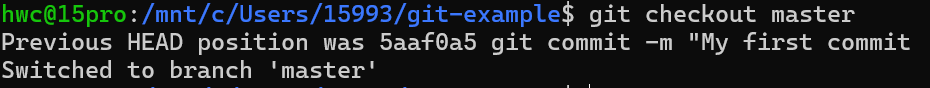
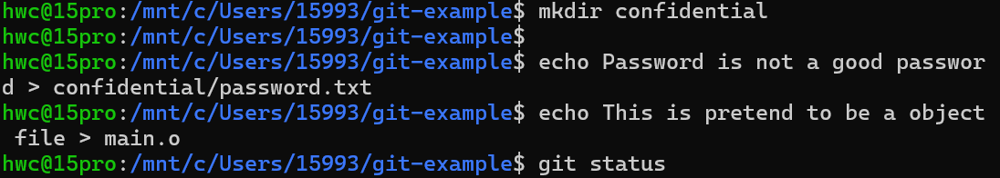
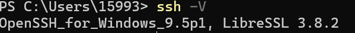

# 学习思路

## 本学习内容主要分为五个板块

- 提问及知识获取，包含搜索引擎和大模型的使用，以及如何提问等内容。
- 计算机知识概览，包含对于计算机软硬件及基本体系结构等的简要介绍。
- 充分利用计算机，包含计算机的环境配置、文件版本控制、网络安全等多方面内容。
- Linux 基础使用指南，包含虚拟机创建、环境配置以及部分常用操作等内容。
- 文本编辑与写作工具。

---
## 一板块

### 搜索和知识获取

#### 知识的获取

##### 搜索引擎的选取

一个好的搜索引擎往往能提升查询效率,优先推荐使用微软 [Bing](http://www.bing.com "一个搜索引擎") 搜索


#### 如何搜索？

##### 关键词组合

tip:如果需要用英文可以用翻译。
#### 信息平台


- 官方文档
- [Stack Overflow](https://stackoverflow.com "面向计算机程序员的问答网站")
- [GitHub](https://github.com "在线软件源代码托管服务平台")
- [知乎](https://www.zhihu.com "问答社区")  / [博客园](https://www.cnblogs.com "问答社区") / [简书](https://www.jianshu.com "一种博客") / [bilibili](https://www.bilibili.com "视频平台") / [维基百科](https://www.wikipedia.org "搜索平台")
- [W3schools](https://www.w3schools.com "提供了许多关于开发和编程语言的教程")
- [CS自学指南](https://csdiy.wiki "一本计算机专业相关知识的自学指南，包含了计算机科学、编程、网络安全、操作系统、数据库、分布式系统、机器学习等多个领域的优质课程推荐及资源指南")

#### 提问的智慧

##### 在哪里提问？

- 在前文提到的论坛或问答网站上发表帖子或提问
- 在 Github 上发 Issue
- 尝试在社群中提问
- 问AI 好用的大模型有[Github Copilot](https://github.com/login?return_to=https%3A%2F%2Fgithub.com%2Fcopilot) / [OpenAI](https://openai.com) / [Azure](https://azure.microsoft.com/zh-cn "商业云服务提供商") / [DeepSeek](https://www.deepseek.com)
- 
##### 如何向他人提问？

- 展现出必要的礼貌与尊重
- 尽可能具体地描述你的问题
- 阐释你为解决该问题已经做出的尝试阐释你为解决该问题已经做出的尝试

##### 如何向大模型提问
- 具体性
- 明确性
- 简单化
---
## 二板块
### 1.计算机基本知识概览：软硬件和操作系统
#### 1.1 硬件

- 计算机硬件基本结构（冯.诺依曼架构）
由运算器、控制器、存储器、输入输出设备组成


##### CPU

  CPU 是整个计算机的核心，承担着运算和控制的功能。即为上图中运算器与控制器的合称。代码由一条一条的指令组成。指令可以是修改 CPU 的状态，进行运算，或者是从其他硬件读取信息或者输出信息。CPU 按照顺序一条一条执行从存储设备中读取的指令

##### 内存 / RAM(随机存取存储器)

  内存是处理器 CPU 能够直接访问到的数据存储器。CPU从内存拿出对应存储单元中的数据或者向存储单元写入数据。而随机存储器中“随机”的意思是不论拿什么编号来找数据，所需时间总是差不太多的。与之相对的是顺序存储器，比如磁带（后文有介绍）。
  ")

##### 硬盘

  目前市面上主要有两种硬盘，一种是机械硬盘 HDD里面有一组极为平滑如镜子一样的硬质盘片，表面有磁性物质，旁边有若干磁头，背面则有电路和芯片进行控制。机械硬盘工作时，盘片高速运转，电路控制磁头由于旋转带动的气流从而悬浮在盘片表面(仅有几十纳米甚至更小!)通过磁场读写其中的内容。由于这种机械的旋转结构导致其对振动较为敏感(剧烈的撞击极易导致磁头撞击盘片表面从而损坏磁介质，产生坏道)，严忌于其工作时摔碰。

  另一种是固态硬盘 SSD里面没有高速运转的机械结构，取而代之的是闪存芯片和控制电路，在闪存芯片内部有大量的单元通过捕获电荷来存储信息。

##### 其他存储设备

- U 盘: 较为简化的一种固态硬盘，通过 USB 接口与主机连接，性能较弱，主控结构比较简单，所以可靠性不佳，用于临时的数据搬运。
- 存储卡: 也是一种固态硬盘，接口为移动插拔做了优化。
- 光盘: 在闪存时代前常见的存储设备用于交换数据(如 Windows 安装光碟)，一般只能写入一次，存储容量在几百 M 到几十 G 不等。内部有一层薄介质，通过激光在上面进行刻蚀或由母盘压制而得，并通过反射读取信息。
- 软盘：更古董的设备，一个薄磁性塑料软片，故名软盘，存储容量在几百 KB 至几 MB 左右。
- 磁带：一圈一圈卷起来的塑料磁性软带，因此读取写入只能顺序进行，意味着找数据的时候需要倒带到指定位置，时间和倒带的距离成正比（非常非常非常慢）。曾经用于存储音频，后被用于长时间归档巨量数据，需要特定的仪器和环境，维护成本高。
  
|种类|单盘最大容量|密度|容量/价格	|单盘带宽|延迟|可靠性|维护成本|
|:---:|---|---|---|---|---|---|---|
|HDD|24 TB|中|8 GB/RMB	|300 MB/s|10 ms|高|低|
|SSD|60 TB	|极高|2 GB/RMB|6000 MB/s|50 μs|中|低|
Blu-ray|100 GB|低|5.5 GB/RMB|35 MB/s|100 ms|很高|中|
|Tape|18 TB|极高|45 GB/RMB	|750 MB/s|loooong	|很高|极高|

  存储层次结构
  
  注：
1.这里的主存一般也指内存。
2.本地二级存储即包括上述的硬盘和其他存储设备。

<br>
- 处理器中的寄存器，通常用于存储计算中的临时数据，随取随用性能要求极高，因此使用的晶体管非常多，同时其单位容量价格自然也是十分高。
- 在寄存器和内存中间，一般还存在多级缓存。高速缓存由硬件自动管理，对一般程序员不可见。常用的数据将被放入速度快很多的缓存中。但由于其仍然占用了不少宝贵的芯片面积，故缓存单位容量的价格也比较高，目前个人计算机缓存的容量普遍在数十 MB 以内。
- 以上三种存储都属于易失性存储（volatile），也就是断电后数据将会在短时间内消失。而其中前两种存储是静态随机存储，意味着在通电状态下其状态可保持不需要进行刷新，但制造所需晶体管较多。而后者为了实现更大化地存储，通过电荷存储在一个个微小的电容中，故只需要一个晶体管，但其随着时间电荷会逐渐流失导致数据丢失，因此需要每几个毫秒对每个存储单元都进行刷新操作，故称为动态随机存储。

##### GPU

  全程为Graphics Processing Unit, 也叫做显卡，有独立显卡和集成显卡两种，前者以一种通过 PCIe 接口连接的扩展卡或直接独立集成在主板(通常存在于笔记本或者一体机内)的形式存在，而后者直接存在于处理器 SoC 内部(故名集成)。

  

  注：严格来说，GPU 是显卡上面主要的计算芯片，也可集成在 CPU 中，但是人们经常混用两个概念，故不严加区分。

  一张独立显卡内部，包含居中镜面的硕大的 GPU 核心，供电电路和围绕着核心的若干个显存芯片用于存储图像和计算数据。最左侧是四个视频输出接口，底部金色的 PCIe 接口接触点

  

  GPU 用于图形处理加速和视频输出，同时包含了各类专用的加速单元。后用于大规模并行计算，如 AI，科学计算等等。虽然 GPU 的计算能力远远大于 CPU，但是各自特色分明: CPU 擅长控制和逻辑，单核处理能力强得多，适合各种通用的场合; 而 GPU 仅适用于并行且逻辑简单的计算，以其独特的架构取胜。

##### 主板

将各种硬件连接在一起，形成一个电路系统，为主芯片的工作提供各类条件支持(如供电降压，数据的传输，机械支撑，芯片工作顺序的控制等)，提供固件进行硬件自我检查和系统初始化，保存各个硬件的配置等。


##### 电源

为各类电子元件提供电力。CPU 和 GPU 核心的工作电压通常很低，只有 1V 左右，比一节干电池的电压还来得低，但是工作电流很高，有几十至上百 A。其他辅助芯片的电压通常也只需要 5 V 以内的直流供电。但是一般家庭供电是 220 V, 50 Hz 交流，因此需要此模块进行逐级降低，提供工作所需的大电流低电压。


##### 外设

外设是指连接到计算机主机，用于扩展计算机功能的外部设备。这些设备可以分为输入设备、输出设备和外存储设备三大类：
- 输入设备：用于向计算机输入数据和指令。如键盘，鼠标，摄像头，麦克风等。
- 输出设备：用于将计算机处理后的结果以人们能够感知的形式输出。如显示器，打印机，音响等。
- 外存储设备：用于长期存储数据和程序，可在需要时与计算机主机进行数据交换。如硬盘，光盘，U盘等。
- 外设通过各种接口与计算机主机相连，如 USB、HDMI、音频接口等，使计算机能够与外部世界进行信息交互和数据传输，丰富了计算机的功能和应用场景。

#### 1.2 软件

软件根据其功能不同也可以分为很多种，有一些软件是直接跟硬件打交道的，而另一些软件则直接跟用户打交道。前者包含操作系统和硬件驱动程序，而后者是我们平时使用的各类应用程序。另外，人们发现，各类软件有很多功能是相同的，于是人们开发了各种各样的“库”这个软件，为各个软件公用。

##### 保护和抽象

- 现代 ISA 都提供保护的功能。保护的功能主要是限制对资源的访问，比如虚拟内存技术，低权限的程序只能看到设定好范围的物理内存空间的内容，且是否可以修改，是否可以作为代码执行（回想冯诺依曼架构的内容，代码和数据并没有严格区分）也受到控制。除此之外，处理器提供了特权指令，如访问外部设备，修改保护权限，改变处理器工作模式等等，这些指令的使用也必须受到限制。
- 保护的具体模式：绝大部分的保护都会至少分为两种操作模式，一种叫内核模式（有时候也叫超级用户、特权模式、系统态、核心态、管态等），一种叫用户模式（也叫目态等），部分 ISA 还提供更多操作模式（比如 x86 提供权限从高到低 r0-r3 四个模式，但是主流操作系统只使用 r0 和 r3 两个模式，RiscV 提供机器、系统和用户三个模式）。简单理解，内核模式下，程序拥有对硬件软件资源（几乎）全部的访问权限；而用户模式下程序可进行的操作则受到限制，但是允许通过预先定义的接口，通过内核模式下的程序授权完成需要特权的操作。
- 保护的作用：保护的功能既保护了整个计算机系统不受无意编写有缺陷程序和部分恶意编写的程序的破坏，也能更方便地提供抽象。比如操作系统借助硬件提供的虚拟内存技术，让应用程序拥有完整的虚拟地址空间，应用程序不再需要关心自己被加载到内存的哪个部分，只需要让操作系统完成地址映射和转换即可；又比如操作提供统一的文件访问接口，让应用程序不论是读写硬盘，读写软盘还是读写磁带都只需要使用统一的文件读写接口即可完成。

###### 进程

一个进程(Process)包含了一个程序运行的全部状态和属性。这也是冯诺依曼机的核心思想，当你获得了程序在内存以及寄存器中的状态也就得到了一切。一个例子是休眠，计算机可冻结并将内存写回硬盘并关机，随后在下次开机后恢复，维持原先的程序运行。 操作系统对各个进程分配资源，相互隔离并不断地进行时分复用(硬件上存在一个可编程的计时器每隔固定的间隔触发中断将处理器控制权交由操作系统)，以实现一个系统上同时进行多任务(早期的如 DOS 系统只能同时进行一个程序)。
###### 线程

线程(Thread)是轻量级的进程，一个进程可建立多个线程子程序任务同时执行。一般进程具有处理器和内存地址的隔离，而一个进程下的线程仅有处理器的隔离，虚拟内存地址是共用的，不同线程之间的通信成本要比进程之间小很多。

###### 例外

例外(Exception)，有些时候翻译为异常(此处异常通常指代 abnormality，对于硬件系统中通常异常不等于错误)，通常后者称呼使用更多(后续使用异常这一称呼)。 通常异常的产生代表的是发生了一些例外情况，因此往往也代表着移交控制权，可以发生在硬件层面，也可以发生在软件层面。 硬件层面的异常通常包含有：
- 来自硬件的中断(Interrupt)，比如键盘按下了一个键，或外设如网卡已经获取数据并已将其写入了内存，随后发出中断令处理器切换至相应的处理程序进行响应；
- 陷阱(Trap)，包括调试陷阱，以及来自软件主动请求的系统调用(以前也称软件中断)。前者可用于程序的调试(或者程序运行中对某些状态进行捕获)，而后者目的通常是向 OS 发出某些请求如打开文件等；
- 故障(Fault)，通常是可以恢复的，也可能是有意为止的，可由硬件，也可由软件造成，发生后将调用内核内的故障处理程序处理并随后回到现场继续执行原先的代码，如发生了缺页，除法除数为 0，硬件发生了故障等，在不能处理时也会导致程序终止；
- 终止(Abort)，也就是不可以恢复的严重问题，比如机器检查（一般是严重的硬件错误导致）、双重故障（也就是在处理故障时发生了另一个故障，一个简单的例子是缺页处理程序被交换出去，导致发生缺页时找不到缺页处理程序，从而发生另一个缺页故障）等。

##### 操作系统概述

操作系统的核心部分以及部分硬件驱动程序运行在内核模式下，为上层的各类用户软件提供了对各种资源，比如处理器、内存、网络、各种外部设备如打印机等的统一抽象和管理，使得大部分应用程序在大部分不同的硬件上都能正确、安全、高效地运行，简化了应用程序员的工作，同时也将不同资源进行隔离，尽可能防止有缺陷或者恶意的程序影响其他程序运行。

部分几乎被所有软件使用的库、与内核进行通信并提供人机交互的管理程序等运行在用户模式的程序也被视为操作系统的一部分，而且这部分程序占据的比例不小，和操作系统内核一道进行资源的抽象和管理。

总的来说，操作系统就是一个管理者，为上层应用提供资源和服务，根据其权限和当前系统资源利用情况处理上层应用的请求。

##### Windows

Windows 是微软公司开发的图形化操作系统，具有成熟的图形界面。

##### Linux

严格来说，Linux 只是一个“操作系统内核”，并没有包含用户态的程序，而一般来说，一个完整的操作系统需要包含用户态的一些基础设施，比如供更上层应用程序使用的库函数，以及用于管理其他软件和硬件，但不必放进内核态的程序。目前说 Linux 操作系统，一般指的是基于 Linux 内核衍生的各大发行版。大多发行版采用了来自 GNU 这个组织制作的各类辅助基础设置，故全名为 GNU/Linux。各种 Linux 发行版为 Linux 内核配置了一系列用户态程序，这样才能构成一个完整的操作系统。
##### 其他操作系统

- macOS: 苹果专用，符合 POSIX 标准的 Unix 系统，老版本可在 Intel 机器安装（需要魔法），内核叫 Darwin，修改自 BSD 系内核，内核部分开源
- FreeBSD: 符合 POSIX 标准的类 Unix 系统，和 Linux 只是内核不同，FreeBSD 带有完整的用户态程序，同时其采用更宽松的许可协议，而不是 Linux 的 GPLv2。
- MSDOS: 古老的操作系统，无图形界面，已不使用，微软近期开源了几个版本的 DOS。FreeDOS 则是由其他志愿者实现的开源版本替代。

##### 移动操作系统（即手机平板上的操作系统）

- Android: Google 开发的基于 Linux 内核的操作系统，Google 自己在上面开发了 AOSP 一套基础设施环境。
- iOS: 苹果公司的产品，2007 年随 iPhone 横空问世，基于 Darwin 内核开发，封闭性较强。

##### 应用程序

操作系统大部分情况下只充当资源的管理者，具体的任务还需要更上层的程序依靠操作系统提供的抽象和功能完成。

###### 桌面程序与命令行程序

有些程序有漂亮的图形界面进行人机交互，有些程序则只处理字符流的输入输出。这两种程序分别被成为桌面程序和命令行程序。

###### 库

库作为一种特殊的应用程序，在各种平台上面被广泛使用。库可以是以源代码形式或者封装好的机器码的形式存在。库可以是在程序编译时一同编译并连接，也可以是提前编译好，并在程序编译后以静态或者动态的方式与程序链接在一起。

##### 程序的执行

###### 机器码与汇编

机器语言更底层，汇编语言更顶层。

###### 编译

有两种思路：

- 将高级语言预先翻译成汇编语言，再翻译成机器语言，交付执行
- 预先制作一段叫做解释器的程序，在处理器之上再自行维护一套状态，解释器一行一行读取高级语言源代码，根据源代码改变维护的状态，并进行操作
  
使用这两种思路的高级语言分别被叫做编译型语言和解释型语言.
###### 链接

在计算机领域，链接（Linking）是将多个目标文件或库文件组合成一个可执行文件或库的过程。可分为静态链接和动态链接：
- 静态链接
  在编译阶段，链接器将所有需要的目标文件（.o 文件）以及库文件（如静态库.a 文件）中的相关代码和数据，直接复制并整合到最终生成的可执行文件中。
   
- 动态链接
在编译时，可执行文件中只包含了对动态库的引用信息，而不是将库代码直接复制到可执行文件中。在程序运行时，操作系统会根据可执行文件中的引用信息，动态地加载所需的动态库文件，并将库中的代码和数据映射到进程的地址空间中，实现程序与动态库的链接。
   
###### 可执行文件
在冯诺依曼机内，数据和指令均被存储在磁盘内。为了存储这些这些信息，将其抽象为一个个文件，比如有的储存图片，有的储存程序，有的储存文字信息。每一类信息，都可以一种或多种文件格式保存在电脑存储中。 程序代码也是以一种文件的形式存储，称为可执行文件，具有其特定的储存编码方式，记录了程序启动的方式和环境需求。
###### 程序的加载与结束

对于应用程序，你现在可以启动它了。操作系统会先进行一系列包括权限在内的检查，然后加载程序到内存，可能还需要进行动态链接，然后跳转到指定的第一条指令开始不断运行，直到程序因为非法操作被系统夺回控制权并强行结束，或者程序通过系统提供的接口主动退出为止。

##### 开机

通常，我们称计算机的启动过程为 BOOT，通常在 CPU 或南桥(一个用于辅助 CPU 的芯片，包含了大量低速外设的控制逻辑)中存在着一个极其简易的待机控制电路，其只要在插上电后便会获得电源供应就会运转起来，等待外部的各种信号。当按下开机键的时候，信号经由嵌入式控制器传送至电源控制电路，随后其将启动内部的振荡器为 CPU 的工作提供时钟信号，并将 CPU 复位线以及外设复位线置位，并启动主板上的电源降压单元。当降压单元稳定后其会输出 PWRGD(POWER GOOD)信号通知其取消 CPU 复位，CPU 开始进入工作状态。


##### 软件的许可

软件著作权也是知识产权的一种，受到国内外著作权法的保护。通常，软件的授权分为两种模式，一种是保留所有权利，限制源代码的取得和分发（这样授权的软件暂且称为专有软件）；另外一种是附条件开放源代码的取得和分发（这样授权的软件暂且不太严谨地叫做开源软件）。在使用软件时，一定要注意软件的授权模式，避免侵权。对于保留所有权利的软件，注意不要与他人分享软件副本、激活码等信息；而对开放源代码获取和分发的软件，一般都可以自由分发其副本，这些软件一般也不会有“激活码”等反盗版技术保护措施。但是如果你需要基于这些软件的代码开发衍生软件，则需要注意：

- 一般都需要保留原作者的署名和版权声明
- 对于以 GPL 等 Copyleft 性质的许可证授权的软件，你的代码也需要以同样或者符合原来许可证规定的许可证开源。这种特性也被称为传染性。

#### 1.3 计算机网络

##### OS/I 七层模型
|七层模型| 
|---|
|应用层|
|表示层|
|会话层|
|传输层|
|网络层|
|数据链接层|
|物理层|

目前基本不再使用 5、6 层的说法，按照 OS/I 的定义和现在的实际情况，5、6 层功能被 4、7 层包含。

##### TCP/IP 协议

TCP 和 IP 协议分别工作在上述模型的第四层和第三层，IP 协议为世界上每一个能连入全球互联网的设备分配一个地址，同时提供不可靠的包交换服务。数据包指的是一段长度有限（但不总是固定）的数据，不可靠的包交换意思是把数据包从出发地传送到目的地，但是不保证包按照顺序到达，不保证有且仅有一个包到达，不保证包内容正确。

IP 协议目前有两个版本，一个是 IPv4，其地址由点分十进制，也就是类似于 111.111.111.111 的形式表示，每个十进制范围是 0-255，同时有许多地址被保留，如 127.xxx.xxx.xxx，10.xxx.xxx.xxx，192.168.xxx.xxx，0.0.0.0，255.255.255.255 等等，它们或被用于标示本机回环地址，或被用于局域网内，或被用于广播地址或保留地址。

目前正在快速普及的 IPv4 的后继者是 IPv6，其地址由冒号分隔的 16 进制组成，长度是 128bit。IPv6 资源丰富很多，基本不会存在枯竭问题。

TCP 是在 IP 之上的协议，利用 IP 协议提供的不可靠数据传输，为上层提供流式的端到端可靠数据传输。端口号是在这一层协议定义的。TCP 协议存有状态，必须先双方三次交互建立连接，每个数据报文对方都要确认，报文都带有编号和校验码，确保报文正确按顺序到达。TCP 不能保证服务质量，比如传输速率。

##### DNS 协议

DNS(Domain Name System)协议是用于解析域名信息的协议。我们在日常上网的过程中，由于 IP 地址过于抽象难记，经常会使用类似于 pku.edu.cn 这样的域名，DNS 就是将域名转化为 IP 地址的服务。

### 计算机基本知识概览 II

#### 衡量计算机的指标——面向最终交付的评价

##### 能耗与功耗

功耗是芯片单位时间消耗的电能，而能耗是芯片消耗单位电能完成的工作量。 在比较处理器之间的价值，后者指标似乎更好，对于手机与笔记本电脑，我们希望续航更久；而对于数据中心，我们希望相同一度电能创造更多价值。 而对于前者，功耗通常被作为计算机设计的约束条件.

##### 性能

如何评价一个处理器的性能？这个问题是复杂的，归结为任务的复杂性和多样性。 CPU 作为一种通用处理器，通用便意味着面向日常各种各样的应用，比如视频转码编辑，游戏，文字办公，程序编译等。 不过尽管任务多种多样，但是大多数任务都具有某些种有限的特点，因此为了衡量一个 CPU 性能如何， 人们在这些各种各样的应用中选取了一些典型任务代表常见的任务情况，开发了基准测试程序，也叫 Benchmark。

不过，Benchmark 不是永远有效的，有一些因素对其产生可观的影响。 其中一个重要方面是，人们意识到可以通过对抗性的针对性的优化，或者对其运行规则做出对自己有利的解读。 这里强调的是针对性和对抗性，这种调优不具有普适性，也无法表征整体性能，除了使得数字上更好看，没有什么实际价值。 但是，于此同时，需要认识到软件上的优化也是提高性能的非常重要的办法之一，如可以通过循环展开，向量化等操作获得很高的性能提升。 因此基准测试软件控制了一些可选的选项，在指定的规则框架内进行对比。 这是一个冲突性的，两面性的问题，因此需要辩证地参考，尽信书不如无书。 而典型任务也不代表全部任务，最终效果依然需要落实到实际的应用上。

另一个有趣的例子是 GPU，作为专用的协处理器完成图像处理和 3D 渲染，面向了较高并行的任务进行了优化， 在一些任务，比如视频处理深度学习等，GPU 相比通用处理器具有巨大的性能提升(从而极大的降低了成本，一张显卡的算力可以与百余核高端通用处理器相当，且相当便宜！)，而在另一些任务中相差甚远，几乎不能完成。 这一例子更加强调了系统的重要思想: 设计最终目的是满足目标和功能。

##### 成本

成本包括制造成本和运作成本，而利润是系统运行创造的价值除以其总成本减一。 随着计算机商品的大众化，其一件产品的制造成本与售价之间的差额在不断的缩小，而大多数公司的研发费用只占其收入的 4%～12%。 制造成本主要是指购买一件设备的单次投资，通常其包含了生产的成本与其他的支持成本(如配套的操作系统和软件的研发与生态的维护)， 而运作成本，在互联网大型数据中心是极为重要的，其包括电费，网费，冷却的费用(如空调费)，地皮空间的租金，以及设备损毁更换的开销等。

##### 生态

随着时代发展硬件进步速度逐渐减慢(见后文)，程序员越来越需要承担起提高程序性能的重担，对程序的优化日益显得尤为重要。 由于物理限制，处理器运行主频无法无限提升，因此提高性能的主要实现手段是增加并行性，即通过在单位时间内进行更多无关的计算。

程序优化是一个收益显著的事情。

一个程序未经修改，通过编译器的优化便能获得几倍的性能提升。而通过程序员手工进行并行化编程，程序可以获得非常高的提升：如采用 SIMD 向量指令，即单个指令可以对一个向量内每个元素进行相同操作，从而单位时间计算量增加。或采用多核系统，无关的任务(比如开视频的同时进行微信聊天)之间不存在关联被分布于多个核上从而实现并行加速，而同一程序则可以通过各个线程分而执行相互同步，以提高性能。而经过精细设计构造从而运行于 GPU 的程序，通常可以获得更高的加速比，但是由于 GPU 专用的特点，程序员需要承担很大的心智负担，从而开发调试成本增加。

而这些优化通常离不开程序员对计算机系统的理解和熟悉，这些标准有 CPU 上的 ISA(见前一章)，也有 GPU 系统的如来自 NVIDIA 公司的 CUDA API 和来自 AMD 的 Rocm。一些架构较为易用，程序员负担较小，设备比较大众通用和容易获取，来自制造商的支持较多，来自社区和商业的库较为丰富，从而程序员更倾向于于这些架构开发并进行针对优化，从而导致了程序与架构的黏性。而某些架构设备较为稀有，设计复杂，几乎没有资料和制造商的支持，或是乃至程序几乎无法正常运行，这些无疑增加了开发成本，让人望而生畏。CUDA 的日益垄断日益凸显了生态的重要性。

####  计算机的过去，现在和未来

##### 摩尔定律与后摩尔时代

##### Dennard Scaling Law

##### Amdahl's Law

#### 计算机层次化

当今计算机系统复杂程度日益增高，为了构建高效、可维护和可扩展的系统，因此需要进行层次化。(也被称为 UNIX 哲学，但这一哲学思想不仅仅限于 UNIX 相关，可以说基本涵盖了计算机科学的方方面面。)

- 简单性
  
简单性即主张将复杂的问题分解为一系列简单的问题，然后分而治之。通过将系统分解为小的、独立的模块，每个部件只需要针对这个更小的问题进行研究，可以大幅降低复杂性，提高可维护性和可重用性。

- 模块化

模块化是实现简单性和可维护性的关键，每个模块负责特定的功能，之间通过接口进行交互。通过定义清晰的接口，这些模块可以相互独立地进行开发与测试，而不会对其他模块产生过多的影响，从而实现整个产业链的层次分工专攻，而模块化使得具有更多普适性，从而实现了更多的复用，减少了重复工作。

- 标准化
  
  标准化原则是实现模块化原则的重要手段。通过制定统一的规范和标准，不同的模块可以实现互操作和集成。降低了风险同时保持系统的稳定性和可维护性。

标准化下的一些领域的运作模式

- 在芯片制造领域，通常具有两大模式，一种称为 IDM（Integrated Device Manufacture）模式,集芯片设计、芯片制造、芯片封装和测试等多个产业链环节于一身并进行联合优化，为早期多数集成电路企业采用的模式；而一种被称为 Fabless，这些芯片公司仅实现芯片的设计工作，并将图纸交由芯片代工厂(通常成为 Fab)进行生产，后者包括有台积电(台湾积体电路制造有限公司，英文简称 TSMC)、中芯国际、三星、Global Foundries。设计和制造相分离的 Fabless 降低了设计人员的负担以及企业运行的投资和成本开销，为行业所亲睐。

- 而在芯片设计领域，有一些公司提供设计芯片所需要的工业软件(称为 EDA)，而有另一些公司则以兜售被称为 IP 的模块谋生，这些设计模块只可以完成某些小型的特定功能，如视频输出、图像处理、内存控制器等，以黑盒子出售给各个芯片设计公司。后者通过集成各种 IP 模块与其自己的设计实现拼接组合为最终的 SoC 芯片。

- 在软件领域，这一现象更为普遍。人们将众多子程序集合(也称为库)单独分离出来成为一个个单独的文件，一些在程序编译链接时被其他开发者集合在一起，称为静态链接库；而另一些则是在运行时动态的被其他程序使用，则称为动态链接库。这些子程序用途广泛，有的可用于被开发图形界面如 Qt，有的则包含了视频格式的编解码算法程序，如 libx264,libsvtav1 等，而有一些库则将底层复杂的接口进一步整合抽象为更简单的函数功能。库大大方便了软件的开发，可以很容易地发布、替换或二次开发。
  
---

## 三板块

### 用好你的电脑 I：环境配置，常用软件选择、安装与卸载

### 1. 基本环境配置

#### 1.0 程序编写的过程

从你的想法开始，到可执行文件，最终到一个满意的程序，有如下几个步骤。

提示：

python 等解释型语言，只有解释器。

读者要尤其注意“编辑”与“编译”的区别，“编辑”是我们常说的“敲代码”的过程，而“编译”是编译器将代码翻译成计算机能理解的二进制 01101010……（也就是常说的可执行文件，如 Windows 中的 .exe 文件）的过程，“编辑”发生在“编译”之前的。理解这两个概念对于“编程”是至关重要的。

#### 1.1 C++环境配置——与课程评测系统保持一致

#### 1.1.1 一些前置问题

#### 什么是 GCC/MinGW？

GCC（GNU Compiler Collection）是一类编译器集合。其中，gcc/g++分别是 GCC 下的 C/C++编译器。GCC 目前是 Linux 中最常用的编译器，也是大多数开源项目的首选编译器

MinGW 是一种编译器系统，建立在 GCC 和 binutils 项目上。MinGW 提供了一套简单方便的 Windows 下的基于 GCC 程序开发环境，是一套 GNU 工具集合。

##### 什么是 Clang/LLVM？

Clang 是 C、C++、Objective-C 和 Objective-C++ 编程语言的编译器，基于 LLVM 实现，支持将代码编译到多架构、多平台。而LLVM 是一款广泛应用于编译器开发和程序语言设计的开源项目。

##### 什么是 MSVC 和 Visual Studio？

MSVC（Microsoft Visual C/C++）是微软开发的一套 Windows 下的 C/C++编译器。Visual Studio 是微软的一款集成开发环境（IDE），其中包含了 MSVC 编译器。

#### Visual Studio, XCode, Dev-C++, VS Code 是什么？怎么选？

前三款软件是 IDE（集成开发环境）。其中，Visual Studio，XCode 分别是微软、苹果推出的 IDE，体量较大；Dev-C++是较老的 C++ IDE。VS Code 是一款可拓展的文本编辑器，其功能丰富，体量较轻。

一个趁手的编译环境能够让你专心于实现自己的想法，减少工具的束缚。总的来说，我们想要实现这些目标：

代码书写流畅，支持高亮和自动补全
拥有开放的插件生态和丰富的插件体系
对编译器和调试器有一定的内嵌支持
综合考虑以上要求，我们在这里推荐使用 VS Code 来构建你的编程环境。但我们推荐你在编程上机课使用机房的 Visual Studio，应对考试需求。

#### 1.1.2 Windows 环境配置

#### 什么是环境变量？Path 是什么？

环境变量是包含关于系统及当前登录用户的环境信息的字符串,一些软件程序使用此信息确定在何处放置、使用文件。环境变量的产生可以这样理解。如果你新写了一个程序，需要放到陌生的环境运行。这时候，就需要从系统获取一些和当前环境有关的信息，这就是环境变量。Windows 终端也是这样一个程序，如果在终端中输入 cmd，这并非完整路径，终端需要负责找到实际的程序位置，那么终端又怎么知道去哪些地方寻找呢？它会读取 Path 这个环境变量，从 Path 指示的路径中寻找。如果 Path 中有一条是 C:\Windows\System32\，终端就会从中找到 cmd.exe，于是实际执行了 C:\Windows\System32\cmd.exe。

#### VS Code 的工作逻辑是什么？

vscode 分为全局和工作区两部分组成，结构如下图所示。每次打开 vscode 都会新建一个窗口，叫做“工作区”。工作区中包含一个或多个文件夹，可以拥有与全局不同的设置。

如果工作区只有一个文件夹，配置会被放在该文件夹下 .vscode 文件夹中。如果有多文件夹，工作区配置会用一个 code-workspace 结尾的文件保存。


#### VS Code 如何打开文件夹、将工作设置保存到工作区便于取用？

1.点击左侧边栏第一个按钮，点击打开文件夹，浏览到所需位置并打开。

2.点击界面上方的 “文件” 按钮，找到 “另存为工作区”，选择一个位置来保存工作区设置。

3.点击界面上方的 “文件” 按钮，点击 “从文件打开工作区”，浏览到刚才保存的文件，打开它。

4.如果想在这个工作区添加不同文件夹，如 "C++" "Python" 来便于管理作业，请点击界面上方的 “文件” 按钮，点击 “将文件夹添加到工作区”。

5.以后每次打开 VS Code 后，请从刚才保存的文件打开工作区。这个文件会保存各类设置，包括下文提到的内容。

#### 1.2 Python 环境配置

#### 1.2.1 Conda 是什么？

Conda 是在 Windows、macOS 和 Linux 上运行的开源软件包管理系统和环境管理系统。

使用 Conda 配置 Python 环境，有一个巨大的好处：它可以同时存储各个不同版本的 Python，每个版本具有独立的包和库；使用时，可以用命令很方便地切换要使用的版本（这使用虚拟环境来实现）。

#### 1.3 终端环境配置

##### 1.3.1 Windows 终端配置

Set-ExecutionPolicy PolicyYouWant
建议使用 Remotesigned 策略

##### 1.3.2 常用快捷键和一些指令
- Ctrl+Shift+C/V：终端中的复制和粘贴。
- Ctrl+C：请求终止程序并释放内存。
- Ctrl+Z：请求暂停程序，不释放内存，后续可以恢复执行。
- Ctrl+A：全选代码，方便快速复制提交。
- 按住滚轮，上下滑动：扩展光标所在行数，可以批量在很多行代码前面加 Tab 或者删空格，便于控制缩进。
- ./a.out < in > out：在 Linux 和 macOS 中，此指令可以从 in 读取输入，传递给程序 a.out 作为输入，然后把输出传到文件 out 中。
- get-content in | .\a.exe > out 这个命令功能与上述命令相同，但它在 Windows PowerShell 中使用。
- cd：更改终端所在目录。

## 2. 文件和文本

### 2.1 文件的本质

不同操作系统（如 Windows，Linux，MacOS，Android）都有文件的概念，而且它们对于文件的处理方式有些不同。但是，在各个操作系统中，我们都可以把文件理解为一堆二进制数据的集合——它是计算机存储系统中的基本单位，用于存储数据和信息。

无论文件的类型或内容是什么，计算机存储和处理的所有数据最终都表示为二进制形式，即由 0 和 1 组成的比特序列。例如，Windows 中常用的 txt 文件，它在打开时虽然显示为文字，但在底层，这些字符是通过字符编码（如 ASCII 或 UTF-8）表示为二进制数据的。例如，字符 A 在 ASCII 编码中表示为二进制的 01000001。打开文件时，选用的不同种字符编码，实际上就是告诉计算机用什么标准去读取文件，并按对应的规则显示为字符。

### 2.2 文件的后缀

实际上，文件的后缀是文件命名的一部分，在各个操作系统中一般用.来区分：文件名从左到右的第一个.右边就是文件后缀。因此，文件后缀与文件的具体内容无关，改变它并不会改变文件的内容——归根结底，它只是名字的一部分而已。

虽然文件后缀不影响文件内容，但在现代操作系统中，它有很大的作用。前文提到，在计算机眼里，文件的内容本质是一个二进制序列，不同的文件即使差别很大，但在二进制的世界里，也就是某些位不同而已。由于文件有许多类别（例如文本文件、照片、视频、可执行文件），计算机需要知道用什么方式（应用程序）来打开指定的文件（这些程序会根据它的设计目的，按照某种固定的标准，使用文件中存储的数据。比如，相册打开 bmp 文件时，会将文件开头的固定长度作为文件头，从中读取照片大小、长宽等信息，并按照这些信息在后文中读取像素数据，渲染成图片）；但这又难以从文件内容直接看出来。所以，后缀应运而生——它可以告诉计算机用哪一类应用程序来读取文件。如果随意修改后缀，可能会导致计算机用错误的程序打开文件，或者压根不认识这个后缀，我们就无法看到想要的内容。而实际上所有文件都可以用记事本打开，只不过可能是乱码罢了。(后缀真是个伟大的发明！)

常见的后缀：

- 文本和文档：.txt、.doc、.docx、.xls、.xlsx、.ppt、.pptx。前者是记事本文件，后面则是 Word、Excel、PowerPoint 软件的文件格式。
- 源代码：C++：.cpp、.cc、.cxx、.hpp、.hxx
​C：.h、.c
​Python：.py

源代码文件都可以用记事本打开。它们的本质都是文本。
- 视频文件：.mp4、.avi、.mkv、.ts、.m3u8 等。
- 图片：.jpg/.jpeg、.png、.gif、.bmp、.webp、.svg 等。
- 压缩文件：.zip、.rar、.7z 等。常用于 Linux 系统的有：.tar.gz、.tar.xz。常用于 macOS 系统的有：.dmg（用于分发软件）。用于光盘，或虚拟光盘的为：.iso，可用来存放系统镜像。
- 可执行文件：Windows：.exe；Linux/Unix：无；MacOS：无，或 .app；Java 程序：.jar
- 脚本文件：Windows：.bat、.cmd、.ps1；Linux/Unix：.sh

### 2.3 文件系统

我们都知道，文件存储在硬盘等实体介质中。为了便于管理文件，人们发明了“文件系统”，用于管理和组织存储设备（如硬盘、SSD、光盘等）上的文件。下面是文件系统上的一些概念：

- 目录（文件夹）：是包含文件和子目录的特殊文件，用于组织和管理文件。
- 文件路径：
1. 绝对路径：从根目录开始的完整路径，例如 /home/user/document.txt。
2. 相对路径：相对于当前工作目录的路径，例如 document.txt。
  - 元数据：文件系统存储文件和目录的元数据，包括文件名、大小、创建时间、修改时间、权限等。
  - 
  文件系统的部分功能如下：
- 管理文件权限：
1. 文件系统管理文件和目录的访问权限，通常包括读取、写入和执行权限。
2. 在类 Unix 系统中，文件权限由所有者、所属组和其他用户的权限组成。
- 文件操作：

文件系统提供基本的文件操作，如创建、删除、读取、写入、重命名、复制等。

- 挂载和卸载：

文件系统可以挂载到操作系统的目录树中，使其内容可访问。卸载文件系统会断开这种连接。

### 2.4 文本

文本是一类特殊的文件，由于源代码文件也属于文本，且我们日常接触较多文本类文件，这里着重提及。

我们首先来看纯文本，在各类系统中可以使用 txt 后缀来区分，打开它时会调用系统自带的纯文本编辑器，例如 Windows 上的记事本。这类文本基本只有单纯的显示字符的功能，没有其他额外功能。实际上，各类后缀的源代码本质也是此类文本。

#### 文本的编码

上述文本的保存和显示需要用到编码。前文提到，所谓编码，就是将字符转换为二进制数据的规则，它是一种字符与二进制数据的对应关系，可以理解为数学上的双射。保存文本文件和打开文本文件时，分别需要选择一种编码格式。如果这两种编码格式不匹配，打开时就可能显示乱码，例如常见的锟斤拷烫烫烫。如果编码 A 是编码 B 的子集，那么，用 A 保存、用 B 打开也是可以的。下面这张图展示了常见编码之间的关系：


图中可以看到，ASCII 编码是图中其他编码的子集，因此用它保存的文本，用其他编码都可以打开。（UTF-16，UTF-32 等除外）。

#### 文本的字体

除了编码和文本显示有关系，字体也会影响文本的显示方式。选择一种心仪的字体对于完成文本类工作是非常重要的。

一些常见字体：

- 微软雅黑：一种由微软公司开发的中文无衬线字体，专为简体中文用户设计。版权归属方正集团。
- 宋体：是中文字体中最常见的一种衬线字体，广泛用于各种正式和非正式的文档中。有思源宋体、方正宋体、方正仿宋等变种，它们都可以免费商用。
- 黑体：一种无衬线字体，字形端正，笔画横平竖直，笔迹全部一样粗细。思源黑体可以免费商用。
- Consolas：一种等宽字体，推荐用于编程。

下面介绍 VS Code 更改字体的方法。依次选中文件->首选项->设置，搜索字体，在 Font Size 和 Font Family 中更改字体大小和字体系列。逗号分隔字体，系统会依次搜索可以使用于当前文本的字体。

#### 各类文本和文档

除了纯文本，还有许多种文档被广泛使用。下面列举其中的一部分：

- Word 文本
- Excel 表格
- PowerPoint 幻灯片
- PDF：是 Adobe 开发的文件格式，广泛用于公文、电子书、论文等正式文档，较为安全。
- Markdown：一种轻量级标记语言，旨在以简洁易读的纯文本格式编写文档，同时能够转换为结构化的 HTML 等格式。
- LaTeX：是基于 TeX 的文档排版系统，提供高级命令和宏包，简化了复杂文档特别是包含数学公式的技术和科学文档的编写和排版。可以编译生成 PDF 文档。
### 2.5 创建文件

在 Windows 上，要创建一份文件，可以在右键菜单中选择创建文本文档，然后根据需要修改名称和后缀。

## 3. 软件的安装和卸载

安装卸载软件听起来是很简单的事——但其中其实有很多门道。有一则笑话：“我熟练掌握 PS、AE、Word、Excel、PowerPoint 等软件的安装和卸载”，听起来很好笑，但许多软件的安装和卸载本身也是有难度的。在这一部分中，我们来了解一下如何正确地安装、卸载软件，打造一个干净的电脑环境。

### 3.1 软件的安装

#### 定位官网

常用的免费/付费软件都会有一个官网。然而，由于近年来搜索引擎广告严重，许多官网难以找到，甚至人们在寻找官网的时候被带到 “xx 软件园” 等流氓网站。因此，找到官网也成了一门技术活。


如上图，在百度中搜索 steam，第一个结果就不是官网。一般来说，搜索引擎以蓝色小块标注官网的，就是官网。


如上图，我们采用必应搜索引擎搜索 steam，此时第一个结果就是官网。选择一个好的搜索引擎对于找到软件官网很有帮助——我们推荐使用必应，有条件的可以使用谷歌，来寻找需要的软件。相信大家在第二讲中已经有所体会了.

#### 下载软件

进入官网后，一般来说软件下载按钮会出现在主页。但有时候需要耐心寻找。例如 steam 的安装按钮就很小：


找到按钮，进入下载网页后，网站一般会根据电脑类型自动判断需要的安装包。此时，我们只需点击下载按钮，等待下载完成后打开即可；在保护比较严格的电脑上，可能会弹出风险提示，在确认确实是要下载的软件，且软件安全后，选是即可。如果网站没有根据电脑自动选择安装包，如下图：

#### GitHub 上软件的下载

第一次在 GitHub 下载软件的时候，可能有许多人会被它的命名方式困扰。首先，我们需要进入一个项目的 Releases 界面：

（在搜索引擎上搜索你要的软件名，后面加上 GitHub，一般可以搜到它的 GitHub 主页）


然后找到它的 Assets 部分：


通常来讲，我们用的电脑是 Arm64/amd64（x64）架构。常见的轻薄本、游戏本、台式机都是 amd64（x64）架构，我们要找到对应的架构，以及后缀为 .exe 或者 .msi 的文件来安装。Linux 则要找到自己的架构，且后缀为 .deb、.tar.gz 等的文件；MacOS 用户，如果是 Apple 芯片，则要找到 aarch64、arm64 架构，.dmg 后缀的文件来安装。如果是 Intel 芯片，则要找 x64 架构，.dmg 后缀文件安装。

#### 安装软件

打开安装包后，就可以开始安装了。

在 Windows 电脑上：请一定仔细检查所谓极速安装/快速安装这些按钮。出现这些按钮后，建议点击详情，它们一般会默认安装到 C 盘；这时，需要的话，可以点击浏览，安装到其他盘.不需要更改目录的话，也请查看是否有捆绑软件默认勾选。

安装完成后，强烈建议查看整个界面，是否有捆绑软件勾选，再点击完成。

### 3.2 卸载软件

一般来说，Windows 上的软件在安装后会提供卸载程序。

注意：直接把桌面上的软件图标移动到回收站是不可行的！！！

注意：直接把桌面上的软件图标移动到回收站是不可行的！！！

注意：直接把桌面上的软件图标移动到回收站是不可行的！！！

重要的事情说三遍！！！亲测好用！！！

重要的事情说三遍。现在，请到设置的如图部分：


点击后，搜索你要卸载的软件，然后点卸载。

### 3.3 规避流氓、病毒软件

流氓软件多如牛毛，相应的规避方法也不完全相同。在安装软件时（尤其是 Windows），要注意：
- 不要去任何软件园下载软件。
- 不要去下载未经确认安全的盗版资源。这种时候，下载完了可以用 Windows Defender 之类的杀毒软件扫一扫。但也不一定安全。
- 与直觉相反，360 软件管家下载的软件一般是安全的，例如可以下载到正版 steam。
- 安装的时候，安装程序的每一个界面都要留意，例如修改浏览器主页、勾选捆绑软件等行为。甚至有不要取消勾选你不想要的软件这种神奇操作。
- 可以多去 GitHub 下载开源软件。但要注意，开源软件也不一定安全。
  
总之，没有任何方法能彻底避免流氓、病毒软件。这是一个魔高一尺道高一丈的过程。我们能做的，也就是擦亮眼睛，开动脑筋，用我们的火眼金睛去发现问题、规避问题。

### 3.4 获取正版软件

北京大学为大家提供了许多正版软件，方便大家的学习、工作。首先，我们登录门户，找到正版软件并进入：


然后在网站中找到想要的软件来下载。激活过程可能需要校园网环境。

- Adobe：现在，请前往 Adobe Creative Cloud Download 直接下载 Creative Cloud，下载时输入学号邮箱（xxx@stu.pku.edu.cn），会自动跳转到门户登录，登录后就会获得授权。
- VMWare：现在已经免费。请直接去官网下载。
- Office：可按照网站要求，申请学生订阅。或者直接下载软件包，用校园网环境激活。
- MATLAB：可直接下载离线包，用学校邮箱登录来安装。

## 4. 常用软件推荐

这一部分，我们来了解一下不同领域的常用软件，希望能对你有所帮助。我们尽量推荐免费、开源、功能强的软件，从而保持良好、干净的电脑环境。

### 4.1 压缩软件推荐

由于各类网络资源都会使用压缩文件的方式进行发布，寻找一款好用且不流氓的压缩软件很有必要。下面推荐一些常用的压缩软件：

- Windows：
1. 7-zip 或者其变种 7-zip-zstd：老牌压缩软件，能满足大部分需求。7-zip 官方网站；7-zip-zstd 官方网站
2. 老版 Bandizip：请不要升级。新版本有广告。Bandizip - 下载 Bandizip 6.x (bandisoft.com)
3. WinRAR：老牌压缩软件。优点是可以生成 RAR 文件，且功能较全、界面不错。请注意：若要使用此软件，有如下注意事项：
- 必须从英文官网下载：WinRAR download free and support: WinRAR (win-rar.com) 中文版无论是否购买正版都有广告，而英文版无论是否购买正版都没有广告，也不会有弹窗。30 天试用期不会减少。
- 版本号必须大于 7.0.0！！！这是因为，以前的版本有一个重要高危漏洞，可以无需以 .exe 后缀存放文件，执行恶意代码。

### 4.2 播放器推荐
- 所有平台：
VLC：一款开源播放器。[官方下载：VLC media player，最棒的开源播放器 - VideoLAN](https://www.videolan.org/vlc/index.zh_CN.html)
- Windows：
1. Potplayer：一款老牌的播放器，功能强大。官网：[https://potplayer.tv/?lang=zh_CN](https://potplayer.tv/?lang=zh_CN)
2. mpv: 一款开源播放器，需要用户自己配置。官网: [https://mpv.io/](https://mpv.io/)
- 配置可参考[mpv - ArchWiki](mpv - ArchWiki)和 [mpv 播放器的使用引导]([ mpv 播放器的使用引导](https://hooke007.github.io/unofficial/mpv_start.html))
  
 ### 4.3 下载器推荐
 - Windows：
  
    Internet Download Manager：功能强大的一款下载器。同网络环境下，相比于浏览器自带下载功能，提速明显，且可以从网页中下载视频、图片。但是收费。

  ### 4.4 杀毒软件推荐

    主要针对 Windows。

    - 火绒：轻量小巧，且有许多实用功能。但杀毒能力不强。
    - Windows Defender：杀毒能力强，默认自带。但是容易误杀，需要花点时间摸清楚配置。愿意挨个设置白名单的话，还是很好用的。
  
 ### 4.5 文本编辑软件

  - 所有平台：
   - Kate：来自 KDE 的开源文本编辑器，同时具有相当的插件。
   - Visual Code：无需多言，闻名远扬，功能极其强大。
   - Typora：一款轻量的 Markdown 文件编辑器。
   - Vim：一款终端下的文件编辑瑞士军刀，学习难度陡峭。
  - Windows：
   HxD：一款 Windows 二进制文本编辑器。
   - Linux：
    Bless：一款 Linux 二进制文本编辑器。

    ### 4.6 文献管理

  - 所有平台：
  - Zotero：开源且易用的文献管理软件。
  - EndNote：商业出品文献管理软件，收费。
  
  ### 4.7 杂项

  - 浏览器插件：
  - Tampermonkey：可以在网页上执行脚本。
  - uBlock Origin: 高效的广告拦截器，Firefox 上运行效果比 Google Chrome 好些，Google Chrome 正在推行 Manifest V3 标准，uBlock Origin 可能在未来无法在 Chrome 浏览器上使用。
  - uBlock Origin Lite: 符合 Manifest V3 标准的 uBlock Origin，但效果不如 uBlock Origin，因为 Manifest V3 限制了插件访问修改网络请求。
  - DISM++: 国人出品的 Windows 优化工具，并整合了各类 Windows 工具，如 WIM/ESD 镜像备份和挂载等。
  - rufus: Windows 平台下 USB 安装介质烧录小工具。
  - Ventoy: 多系统启动盘制作工具，在只有一个 U 盘的情况下想要安装多个系统就可以使用。
  - Localsend：多平台局域网文件传输软件。实用，且界面美观。iOS 和 macOS 可以在 App Store 找到。Android 可以在 Google Play 找到。
  - Magpie：一款可以使画面清晰度提高的软件。例如，它可以使陈年老游戏的清晰度提升很多。工作原理为重采样，对显卡性能需求较高。
  - Handbrake：使用 ffmpeg 作为后端的一款视频转码软件，全平台，支持红绿蓝三家的硬件加速以及你能想得和你想不到的各类视频音频格式。
  - Geek：Windows 上的一款卸载软件，可以卸载各个软件的残留。
  - Snipaste：多平台通用的截图软件。
  - Everything：文件搜索工具，搜索速度快。
  - FileConverter：可以在很多文件格式间互转。
  - Calibre：电子书管理器，也可以支持电子书格式转换。
  - Croc：也是一款文件互传软件。
  - convertio：也用于文件转换，是一个网站。
  - wiztree：磁盘空间分析工具。
  - WallpaperEngine：可以找到 Steam 创意工坊上的很多壁纸。建议从 Steam 购买并下载。
  - WinSCP: Windows FTP/SFTP 图形客户端。
  - Audacity: 开源的全平台音频编辑软件，易于上手。
  - GIMP: 开源的全平台图片编辑软件。
  - Blender: 开源的全平台 3D 编辑创作软件，使用广泛。
  - Krita: KDE 出品的开源全平台绘图软件。
  - OBS：一款免费录屏软件，适配多平台。
  - KeePassXC: 自由开源的密码管理工具，不同于 1Password 和 Bitwarden 的是，KeePassXC 没有自带的云同步机制。
  - 可以自己用一些类似 WebDav 的方式实现云同步。
  ## 用好你的电脑 II
  ### 版本控制概览
  你是否正在编写项目，希望反复尝试不同的代码的效果？你是否曾经为了调整功能删除过大段代码，后悔时却发现无法找回？你是否想和其他人合作开发项目，却发现代码难以同步？本章你将学习 Git 这一版本控制系统，可以解决以上问题。

  版本控制系统（Version Control System, VCS）用来管理和追踪一个软件的源文件版本的系统，同时也可以提供协作、备份等功能。其可以分为中心化和去中心化两种工作方式。

  ### 中心化版本控制

  中心化的工作方式必须有一个服务器，储存所有的版本记录，客户端只负责拉取某个版本，进行修改，并推送回去。代表作有 SVN。

  ### 去中心化的版本控制

  而去中心化的工作方式中，每个人都有完整的版本记录，可以存在中心服务器用于交换各个客户端的提交，但是即使服务器下线或者不存在，两个人之间也可以通过互相交换信息来完成版本同步。代表作有 Git。请注意，Git 和 GitHub，GitLab 并不是同一个东西，前者是 VCS，后者是使用 Git 作为 VCS 的代码托管平台。

  ### Git 的基本理念

  Git 的设计出于这样一种基本抽象：一个项目的历史记录可以被看作是一个有向无环图（DAG），每个提交是一个节点，每个节点有一个或多个父节点，代表这个提交是由哪些提交衍生出来的。Git 的基本操作就是在这个图上进行操作，比如创建新的节点，删除节点，合并节点等等。或许同学们不熟悉有向无环图这个概念，我们举个例子：家谱就可以类比为一个有向无环图，每个人是一个节点，每个人有父母，父母又有父母，但是不可能有一个人的父母是他自己，也不会有一个人的父母是他的后代，这样就构成了一个有向无环图。

  对于 Git 来说，有三个目录：工作区（Working Directory），暂存区（Staging Area）和版本库（Repository）。工作区就是你的项目目录，你可以随意改动，直到你决定记录你的修改。版本库是 Git 存储有向无环图的地方。暂存区可能不那么好理解，暂存区是一个缓冲区，你可以把你的修改放到暂存区，然后一次性提交到版本库，差不多就是这样：


有点抽象，我们举个例子：

我们假设有一个 Git 仓库（Repository），里面有两个文件 A 和 B。仓库之前有提交记录。此时你开始基于之前的提交记录工作，你从历史中取出了文件 A 和 B 放到工作区（这其实是自动的）。此刻就像这样：


然后你修改了文件 A，这对 Git 的状态没有任何影响：因为你没有告诉 Git 你修改了文件 A。这时候你可以把文件 A 放到暂存区，这样 Git 就知道你修改了文件 A。这时候 Git 的状态是这样的：


然后你修改了文件 B，并把 B 放到暂存区，这时候 Git 的状态是这样的：


你觉得差不多了，这时你打算永久保存工作区目前的状态，就把暂存区提交到版本库，这时候 Git 的状态是这样的：


你的暂存区已经被保存到了版本库，就是版本 Y 节点。这时候工作区和版本库最新节点一致，暂存区是空的。

### Git 的使用

下面我们分步介绍 Git 的使用方法：

#### 初始化仓库

使用 init 子命令来初始化一个仓库。打开 shell，执行：


看到以下内容：


如果你看到如下内容，意思是你系统的 git 默认选择了 master 作为主分支的名字。目前我们推荐使用 main 作为主分支的名字，你可以根据它的建议进行配置：

```
提示： 使用 'master' 作为初始分支的名称。这个默认分支名称可能会更改。要在新仓库中
提示： 配置使用初始分支名，并消除这条警告，请执行：
提示：
提示：  git config --global init.defaultBranch <名称>
提示：
提示： 除了 'master' 之外，通常选定的名字有 'main'、'trunk' 和 'development'。
提示： 可以通过以下命令重命名刚创建的分支：
提示：
提示：  git branch -m <name>
```

#### 配置 Git

我们可能需要对仓库进行一些配置，比如设置用户名和邮箱，设置代理等等。

配置 Git 只需要用到 config 子命令。如果需要修改全局设置，可以加上 --global 参数，如果需要打开配置文件进行编辑，可以加上 --edit 参数。现在我们修改一下全局参数，执行：

```
git config --global --edit
```
然后你的终端应该会打开一个文本编辑器，然后在 [user] 模块下找到 name = xxx 和 email = xxx@xxx，将两者修改为自己的信息。如果这两行不存在，你可以在 [user] 后另起一行，加上这两行信息，如果 [user] 也不存在，你可以在文件末尾另起一行加上。


由于众所周知的原因，你可能需要使用代理。请在文件末尾另起一行，填写以下内容，其中链接需要填写你自己的链接：

```
[http]
    proxy = http://127.0.0.1:7890（请更改为你自己的链接）
[https]
    proxy = http://127.0.0.1:7890（同上）
```

有时候对于某些 repo，你想使用其他的名称或者邮箱进行提交，这时你可以在 repo 目录中执行：


用和全局配置类似的方法，配置你的用户名和邮箱。


#### 暂存你的更改

使用 add 子命令可以暂存某一个文件的更改，以便后续提交。先试着在目录中创建一个文件，内容是 Hello, world!，然后暂存：


使用.指示所有未被忽略的文件，你也可以写出具体的文件路径进行暂存。

执行：


查看当前分支的状态，如果你前面操作全部正确，你应该看到如下内容：


#### 提交你的更改

使用 commit 子命令来提交你的更改。执行：

```
git commit
```

会弹出文本编辑器，请在第一行写你的提交信息，比如 My first commit，然后退出编辑器。或者你也可以执行：

```
git commit -m "My first commit
```

达到同样的效果。此时你应该能看到如下信息：


这个时候我们再执行一遍：


你会发现目前处于“干净的工作区”


总结一下，git 整体的工作流程就是修改-暂存-提交-下一轮修改-……这样一直进行。

如果你觉得暂存操作比较麻烦，可以加上 -a 参数，此参数会在提交前自动暂存修改过和删除的文件，但是新的文件不会被包括进来。

有时候上一个提交还没有完成，你可以使用 --amend 参数修订上一个提交。

#### 查看并回退到指定历史版本

在开始讲解之前，我们再建立一个提交，方便后续讲解。执行：


如果你之前都是按照教程完成的，你应该可以看到：


 然后我们使用 log 子命令，执行：

 

 你应该可以看到类似以下内容：


其中 commit 后面跟着的编号（实际上是散列值）、日期会不同，作者和邮箱信息应该是你刚刚设置的。

此时我们想检查第一个提交，这个时候我们可以使用多种方式来完成，我们先使用 checkout 子命令：


此时该提交被检出，当前工作区应该回到上一个提交的状态，显示：


你可以使用


检查文件内容。

事实上，使用散列值指定提交时，若无歧义，写前 5 个字符即可。

如果你想回到最新的提交，执行：



即可。

如果你想回退到当前提交，可以使用

```
git reset --hard 7a6ab
```

此命令将签出并将头指针指向指定提交。后续提交除非你知道提交的散列值，否则你无法找回提交。可以使用垃圾回收（gc 子命令）清除未被引用的提交。

```
警告

请谨慎使用 hard reset
```

### 排除掉特定的文件

有时候一些文件不应该被版本管理系统追踪，如编译生成的目标文件，可执行文件，一些敏感配置等等。我们可以使用 .gitignore 文件来排除指定文件和文件夹。执行以下内容：



应该可以看到以下内容：


我们再执行：


应该可以看到


可以发现 credential 目录和所有的 .o 文件都被忽略了。

最后我们执行


将这一修改纳入 VCS 进行管理。


完成这一节。

### 分支管理

有时候我们会想同时开发新功能，并且调优以前的代码，这样可能就需要两条线进行开发，此时分支相关的功能就会很有帮助。分支的英文是 branch，其实就像树枝一样，你可以在树干上开出一个新的树枝，然后在这个树枝上进行开发，多条树枝之间不会影响，同时树枝也可以合并到树干上(感觉就像多叉树诶)

接下来的例子，我们将演示如何创建分支、变基分支、合并分支以及冲突解决。

首先我们执行：


查看目前分支的记录，参考结果如下：


### 创建分支

我们想以第二个提交为根节点，向上延伸分支，我们可以执行：


以上等价于执行


然后我们将文件 example1.txt 改为 Hello, Git2!，执行：


提交更改。

### 变基分支

接着我们将刚刚创建的提交变到主线上，如下图所示：

```
A-----B-----C (master)
       \                  A-----B-----C-----D  (update_example)
        \            ===>         (master)
         D    (update-example)
```

只需执行


分支 update-example 将重新以 master 的最新提交为根基。 请注意，rebase 会使得移动的全部提交的散列值被重新计算！因为 git 提交的散列值与上一个提交的散列值有关。

### 合并分支与冲突解决

合并分支是一种比较有意思的操作，因为其会产生一种叫做合并提交的提交。 合并提交本身的特别性在于，其具有多于一个的父提交，因此可以将两个分支合并到一起。

我们将 master 的 HEAD 设置到刚刚 rebase 后的分支的顶部，然后我们新建一个分支：


然后我们检出 master，然后执行：


由于合并的两个分支涉及同一行的修改，git 没有办法决定如何应用这些修改，因此需要手动介入解决。 变基操作也会出现冲突，感兴趣的同学可以尝试一下如何解决。 如果不出意外，你应该看到：

```

自动合并 example1.txt
冲突（内容）：合并冲突于 example1.txt
自动合并失败，修正冲突然后提交修正的结果。

```

我们打开 example1.txt 查看内容：

```

<<<<<<< HEAD
Hello, Git2!
=======
Hello, Git6!
>>>>>>> merge-example

```

如果你使用 VSCode 等 IDE，应该已经自动显示修正冲突的选项。我们在这里把结果修正为：

```

Hello, Git8!

```

然后我们运行：
```

git add .
git merge --continue

```

应该会弹出一个文本编辑器，编辑合并提交的消息，然后退出即可。

### Git 服务器与多人合作

到这里你已经完成了 Git 大部分基础功能的学习！下面我们看看如何用 Git 进行多人合作：

#### 克隆仓库

克隆就是把别人的代码仓库复制一份过来。一般来说，执行：

#### 拉取代码

有时候远端代码库已经更新，你需要更新本地代码，这时候用 pull 子命令。

```
git pull

```

事实上，pull 子命令同时执行了 fetch 然后将当前分支的 HEAD 指针指向远端对应分支的 HEAD 指针。

如果本地有远端不存在的提交，则拉取代码不能以默认的 “fast-forward” 方式进行，因此需要指定 --no-ff 参数进行合并拉取或者指定 --rebase 进行变基拉取。在特别有必要时，也可以直接 hard reset 到远端 HEAD 处，丢弃本地未上传的提交。

由于本地的提交可以很方便的进行变基，不用担心散列值重新计算带来的合作上的冲突，建议出现拉取冲突时使用变基的方式解决，而合并会引入不必要的非线性历史，可能会让历史记录不太简洁。

#### 推送代码

在工作完成，提交完成之后，可以用这个子命令将修改推送至远端。若有远端有本地没有的提交，需要先进行拉取，才能推送，或者 --force 强制推送，此时不一致的提交会被本地提交代替。

#### 分叉与合并请求/拉取请求

一般的代码托管平台提供三种合并方式：

- 合并(merge)：创建一个基于提出请求的分支和目标分支的合并提交（见前面合并分支部分的说明）
- 变基(rebase)：将提出请求的分支中的相关提交的修改内容依次应用到目标分支上
- 压缩(squash)：将提出请求的分支中的相关提交的修改内容作为一个提交应用到目标分支上
  
请注意，变基的合并方式不会把提出请求的分支中的提交原样纳入到目标分支上，因为变基需要重新计算每个提交的散列值（部分代码托管平台对于可以快进的情况变基不会重新计算散列值），因此基于散列值的内容，比如提交签名，可能会失效。

如果需要线性历史，建议不使用合并的请求合并方式。

#### 图形化工具的使用

- VSCode
  VSCode 自带 Git 管理功能，可以使用该功能进行可视化编辑和提交
-  gitg
  Gnome 桌面的 git 管理软件
-  kommit
  KDE 桌面的 git 管理软件

  ### 结语

  Git 部分的介绍就暂告一段段落了。Git 本身有上百个子命令，本教程肯定无法完全覆盖，很多高级用法自然也没有办法介绍。更多信息可以访问[Git Book](Git Book)学习，也可以参考 man 手册。
  

  ## 用好你的电脑 III：故障自查与知识串讲

  ### 硬件资源监控

  有时候我们需要检查硬件的信息，包括处理器占用情况，内存占用情况，磁盘占用情况等等，以进行故障排除。

  #### 磁盘信息

  如需查看磁盘占用情况，Windows 和 Linux 下的文件管理器都能直观地提供以上信息，故此不再详述。

如需查看磁盘健康情况，可以使用 smartctl 命令(Linux)或者 CrystalDiskInfo 软件(Windows)查看。


#### 处理器与内存信息

Windows 下任务管理器即可，Linux 下推荐btop程序。


#### 电池信息

Windows 下可以使用自带的 powercfg 命令生成 html 格式的电池信息报告，Linux 下可以使用 upower 命令查看

### 常见故障自查

#### 蓝屏

蓝屏(BSOD, Blue Screen of Death)，通常意味着 Windows 内核发生了不可恢复的故障。常见的蓝屏原因包括系统服务异常（多是驱动导致），关键进程退出（可能是病毒引起），机器检查（硬件故障）等。如果最近新安装了硬件，可以考虑移除它们再试试，如果怀疑是驱动问题或者是病毒问题，可以考虑进入安全模式：

- 如果你还能进入系统：按下 Win+R 输入 msconfig 并回车，点击“引导”选项卡，勾选“安全启动”，点击应用，重启即可。

- 如果你不能进入系统：启动失败若干次后应该会出现恢复菜单，点击“疑难解答”-“高级选项”-“启动设置”，会提示重启进入安全模式。
  
安全模式下只有最基本的驱动和启动项会被加载，可以考虑卸载最近安装的驱动或者查杀病毒，如需查杀病毒，建议选择带网络的安全模式。

以前的系统也可通过启动时按 F8 进入安全模式菜单，但是目前这样做不太可行。

完成所有操作后，如果使用 msconfig 设置了安全模式，应当先取消勾选然后应用，然后重启回到正常模式看问题是否解决。

如果你想向驱动作者报告问题，可以使用 WinDbg 调试内核转储文件，在 WinDbg 中打开转储文件，使用 !analyze -v 获取完整分析报告。WinDbg 可以在应用商店中免费获取。

#### 内核恐慌

Linux 内核的严重错误被叫做 panic。其实由于 Linux 用户态和内核态耦合更低，且 Linux 本身容错能力更好，Linux panic 遇见的频率相对更低，常见的原因也不外乎驱动故障，1 号进程退出等。一般来说，部分硬件厂商为 Linux 提供的驱动问题较多，除了卸载驱动以外，还需要和驱动开发者和 Linux 内核维护者进行沟通，以取得更好的解决方案。

#### 应用软件崩溃

这种情况比较复杂，有可能是软件本身的 bug，也有可能是用户的环境或者使用软件的方式的问题。部分软件带有崩溃反馈模块，你可以用这个模块向开发者反馈信息。在反馈之前，请先确保你的软件是最新的，因为你发现的故障可能在新版本中已经被修复，同时需确保你正确使用软件。然后向开发者反馈故障时，尽可能给出软件版本、操作系统版本、库版本（如果有需要）、硬件型号等信息，同时需给出较为详细的复现故障的步骤，必要时附上日志和截图（不要在正文中放大段日志，最好以附件或者在线剪贴板链接，如 gist 的形式给出）。如果你使用 Linux 并且恰好开启了核心转储，你也可以调试转储文件（例如使用 coredumpctl -r debug，然后输入 bt），给出栈回溯信息等。

如果你想自行调试，首先你可以寻找软件是否提供了调试符号包，在没有调试符号包和源码的情况下调试将会是非常困难的，而且两者都不提供的软件通常在许可上不允许你做调试（因为会涉及反汇编），除非万不得已，不建议自行调试这种软件。如果没有调试符号包但是有源码，你可以尝试在干净的环境中重新构建带调试符号的软件包，对于用 gcc 编译的软件，可以考虑加上编译参数 -g。同时不建议使用较高的优化等级，这会给调试带来困难，除非你确信是高优化等级导致的问题。

#### 系统启动慢

Windows 下打开任务管理器检查有无不必要启动项，加以禁止即可；Linux 下可以使用 journalctl 检查日志，留意启动慢的服务，有针对性地加以解决，或者直接禁用服务

#### 应用程序慢

建议首先检查内存和处理器占用情况，结束其他无关程序；对于有网络 IO 的程序，检查网络连接；对于有磁盘 IO 的程序，检查磁盘健康状态。

#### 网络连接故障

建议检查网线是否插好，网关是否登陆，是否欠费，DNS 设置是否正确，上一次关机时代理是否正确关闭等等。对于 Linux 系统，可以检查 rfkill 是否允许相应网卡工作，ip 是否启动相应适配器。

### 小知识串讲

#### 快捷键

##### 系统快捷键

不同系统提供了不同的快捷键，这里简单介绍 Windows 和 Linux 在系统层面提供的快捷键。Windows 徽标键（简称 Win 键）在 Linux 下也称 Meta 键，在 macOS 下则是 Command 键。F1-F12 系列按键有可能需要同时按下 Fn 键使用。

Windows

- Ctrl+Alt+Del: 打开一个可以唤起任务管理器的屏幕。这个组合键比较特殊，它只能被内核捕获而不会传给用户态程序处理。
- Ctrl+Shift+Esc: 直接打开任务管理器。
-  Alt+F4: 关闭处于焦点的窗口。如果没有窗口处于焦点，打开关闭计算机的对话框。
-  Alt+Tab: 切换窗口。
-  Win+Tab: 切换桌面。
-  Win+R: 打开运行窗口。
-  PrintScreen(PrtSc): 截图

Linux

Linux 下很多快捷键由桌面环境提供，在此无法一一讲述，有兴趣的可以自行了解。一般这些快捷键可以根据个人使用习惯重新配置。

- Ctrl+Alt+{F1-F12}: 切换 tty。一般图形桌面位于 tty1 或者 tty2。这一系列快捷键由 Wayland 或者 Xorg 提供
- Alt+SysRq: 这是一系列快捷键，其中 SysRq 键就是 PrintScreen 键（有的键盘应该会在 PrintScreen 键下面一行写上 SysRq），按下这个组合键后，再按下特定按键，内核会有不同的功能，如按下 C 会让内核强制崩溃；按下 E 会向所有进程发送 SIGTERM 使得它们可以做一些清理后退出；按下 I 会向所有进程发送 SIGKILL 使得它们强行退出；按下 S 会同步磁盘写入；按下 U 会使得所有文件系统被重新挂载为只读；按下 B 会让计算机立刻重启。注意：SysRq 功能可以使用 sysctl 进行配置，默认可能并未开启全部功能。利用这些快捷键可以救回卡死的系统，或者可以在保证文件系统完整的情况下强行重启电脑。

### Shell 快捷键

我们把这些快捷键单独放一栏。因为它们和操作系统关系较小。这些快捷键如无特殊说明主要针对 Linux Shell。

- Ctrl+C: 发送 SIGINT 到前台进程组，默认行为是程序退出。在 Shell 中复制文本避免按下此键！
- Ctrl+D: 关闭标准输入，或者说发送 EOF（文件末尾）。在 Windows Shell 中，一般为Ctrl+Z, Enter。
- Ctrl+Z: 发送 SIGTSTP 到前台进程组，默认行为是程序退出，可用fg使程序恢复运行，或使用bg使程序在后台恢复运行，或者直接向程序发送 SIGCONT 恢复运行。
- Ctrl+\: 发送 SIGQUIT 到前台进程组，和 SIGINT 不同的是，该信号默认不仅让程序退出，还会产生核心转储文件(coredump)。
- Ctrl+Shift+C: 复制内容。
- Ctrl+Shift+V: 粘贴内容。
- Ctrl+A: 编辑命令时回到行首。
- Ctrl+L: 清除屏幕，并重新打印当前行。
  还有其他很多快捷键，有兴趣的同学可以网上搜索或者看 bash 的 man 手册。

  ## 用好你的电脑 IV

  ### 网络安全

  写在前面，虽然这部分的标题叫做 “网络安全”，但不会介绍任何关于网络的技术层面的协议或是加密方式实现原理，而是主要介绍如何更好地使用现在这个并不太平的互联网，请放心食用。（我勒个请放心食用啊）

  #### 小心搜索引擎中的陷阱

  省流：用优秀的搜索引擎如bing，而不是用可怕的360！！

  #### 如何更好地搜索

  最基础的搜索引擎使用技巧是使用关键词而非问句，比如将 怎么下载steam 更换为 steam 下载。而对于一些有关国外的信息，使用英文搜索通常可以获得更为准确的结果。另外要辨认信息来源，有帮助的信息来源很多样化，包括但不限于官方文档、专门的资料汇总网站、论坛、前人整理的文章等，但要小心自媒体等“看上去就很不靠谱”的信息来源。一般来讲，信息来源越专业获得信息的效率与准确度越高。

- 双引号(" ")，可能是最常见的输入修饰符，比如输入 "马克斯"，就不会出现有关马克思的结果，也不会出现有关马斯克的结果。
- 减号(-)，- 后面表示不会出现在搜索结果中的词，比如 米哈游 -原神 就只会返回与原神无关的米哈游信息。
- 或(OR |)，OR, | 表示满足两个关键词中的一个即会出现在搜索结果中，比如 原神 OR 绝区零, 原神 | 绝区零会同时返回有关两个游戏的结果。注意这里的 OR 必须大写。
- 限定网站搜索(site: )，使用 site: 后接网站域名的格式，限定只对特定网站进行搜索。比如 原神 site:www.bilibili.com 只会搜索 B 站中有关于原神的内容。对于一些网站本身搜索功能不令人满意的情况可以使用这种技巧。
- 限定标题搜索(intitle: ,allintitle: )，intitle: 关键词后接关键字，表示要搜索的关键字只会在标题中出现。比如 intitle: 这辈子有了 中所有的结果标题中带有相应的搜索词。当需要标题中有多个关键词时，可以使用 allintitle:，比如 alltintitle:原神 星穹铁道 绝区零 可以搜集到标题中同时涉及这三款游戏的条目。
- 限定正文搜索(intext: )，通常与 intitle: 结合使用，表示关键词应该在正文中出现。比如 intitle:黑神话 intext:政治正确 ，可以精准定位将这款游戏与政治正确联系起来的一些报道。
- 文件类型搜索(filetype: )，filetype: 后面接文件类型，可以直接搜索文件而非网页。比如 米哈游 filetype:pdf 可以直接搜索到有关米哈游的一些 pdf 文件。
  （这作者有点东西，成分有点复杂）

  ### 什么是 url

  URL（Uniform Resource Locator，统一资源定位符），也就是出现在浏览器“网址框”中的那一长串字符。一般包含协议、域名、路径、查询字符串等信息。 比如这个一长串 url:
  https://search.bilibili.com/all?keyword=never+gonna+give+you+up&from_source=webtop_search&search_source=5
  - https:// 表示访问资源使用的是 https:// 协议
  - search.bilibili.com 是域名，也即 b 站的搜索页面。
  - /all 是路径，也即访问的资源在域名的 /all 目录下。其它情况下可能会有更复杂的路径，协议+域名+路径是最常见的 url 组成形式。
  - ? 后面的所有信息都是查询字符串，表示我们向服务器发送的请求。能表示在 url 中的请求都以 xxx=yyy 的 键值对 形式出现，并用 & 连接多个键值对。比如这里的 keyword=never+gonna+give+you+up 代表我们的搜索关键词是 never gonna give you up。如果更改后面的内容，会发现显示在网页搜索框中的词也同步发生了变化。再后面的 from_source 键值对可能表示搜索请求来自于网站顶部的搜索框。而 search_source 可能与网站内部逻辑有关。
  
  顺带一提，B 站（可能其它视频软件也有类似的现象）网页端生成的视频分享链接后也同样带有着相同的查询请求字符串，很可能用来标记这个分享链接的生成来源。前段时间有 b站给我推送了qq群群友的账号 之类的新闻，而这种隐私泄露很可能与分享链接有关。如果有需要，可以将 ? 及后面的全部内容删掉后再进行分享，只保留域名和路径就可以实现对视频等资源的正常访问。

  ### 隐私保护

  隐私泄露一直是很严重的一项问题，甚至很多隐私泄露不是我们能够防止的。不过在日常中做好相关预防工作，降低自己隐私泄露的风险还是有意义的。

  在线下店消费过后，有时店员会让你一些填写个人信息，名义上说是用于售后服务。这时记得稍微留意一下，售后服务是否真的需要自己留下的这些信息，如果不需要的话随便填写些假信息即可。比如在线下门店购买手机之类的情景下很明显不需要在门店留下自己的信息。

  社交软件以及论坛同样是隐私泄露的重灾区，除非工作需要没必要在头像、用户名等公开信息中用到任何关于自己个人隐私的信息。设置-隐私 中一般会有关于自己个人信息可见度的设置，可以根据个人需要进行设置。需要特别注意的是，微信中的 允许陌生人查看十条朋友圈 和支付宝中的 向好友公开我的真实姓名 是默认开启的，强烈建议关闭，尤其在这两个账号都可以被手机号搜索到的情况下。（当然也可以在 添加我的方式 中把手机号等途径取消掉）

  ### 简单的安全措施

  在当今的互联网世界，与安全最直接相关的无疑是自己在各个平台下设置的密码（password，更准确的说法是“口令”，但是我们在这里不区分“口令”与“密码”的区别），以及有约等于密码效力的手机验证码。除了防止自己密码被别人偷看这种事情之外，最应该做的事就是不要用弱密码，再就是尽量在不同的平台用不同的密码。诸如 qwertyuiop, aptx4869, password 及其各种变种，类似于 p@5sw0Rd 等看似很安全的密码，以及常见的日期，拼音等都位于随手就能查到的弱密码库内。密码尽可能不要带有含义，或者说最好能保证只对自己有含义。市面上存在一些密码管理工具，浏览器也开始支持生成随机强密码并与账号绑定进行管理的功能，可以考虑合理地使用这些工具。除了满足以上要求，一般建议密码长度至少 8 个字符，包含大写字母、小写字母、数字和特殊符号中的至少 3 种，有条件的可以定期更换（但是并不强求，自行衡量利弊）。

  一些网站和服务支持多因素认证(2FA)，如果可能的话，请尽量开启这一功能，可以保证你在密码遭到泄露时不至于丧失对账户的控制权。

  校园网内并不太平，有很多被黑客控制的机器（也被称作“肉鸡”）正每时每刻试图扫描校园网内的 SSH、VNC、RDP 等服务，获取受害机器的权限。对于使用弱密码的机器，非常容易在这种扫描中被攻破，从而沦为下一个“肉鸡”，进行攻击、非法挖矿、勒索数据甚至非法窃取数据的黑客活动。我们建议在开启上述服务的机器上的远程身份验证仅开启密钥验证手段（11 章有教程）。如果因为协议本身不支持密钥或者其他特殊原因必须使用密码登录，则务必使用强密码，且建议配置 fail2ban 或者类似服务。Windows 服务器可以在组策略中设置输错密码若干次则锁定账户。

  ### 什么是代理

  代理在日常网络生活中被广泛使用，并且它不只是某项不可言说的东西，所以介绍代理的概念还是十分有必要的。

就像字面意思一样，代理服务器的功能就是代理网络用户去取得网络信息。在一般情况下，我们使用网络浏览器直接去连接其他 Internet 站点取得网络信息时，须先向对方发出请求，然后对方再把信息传送回来。代理服务器是介于浏览器和 Web 服务器之间的一台服务器，有了它之后，浏览器不是直接到 Web 服务器去取回网页而是向代理服务器发出请求，请求报文会先送到代理服务器，由代理服务器来取回浏览器所需要的信息并传送给你的浏览器。

客户端和服务器都可以使用代理。客户端代理可以隐藏真实的客户端 ip 地址、过滤一些不正常的访问请求。当然也可以使用代理绕过访问过滤器。服务端的代理将访问转发给真正的服务器，这层代理可以添加缓存功能，以提高服务器相应速度；也可以进行负载均衡，将请求“均匀”地转发给多台均匀的服务器；也可以作为安全组件，阻挡一些针对于服务器的攻击。

### 操作系统与编程语言

#### 什么是操作系统

用最简单的话来说，操作系统负责管理计算机的软硬件资源，并给用户和其他软件提供接口和环境，是计算机中最基础的软件。

很显然，对于一个程序开发者而言，直接面向硬件编写程序是费时费力的。这样的话，大量的程序可能都会涉及到一些相似的功能，比如如何处理来自键盘等设备的输入，再比如如何管理文件与内存。从“合并同类项”的角度来看，建立一个新的抽象层次来负责管理系统资源相关的事项是自然且合理的。顺带一提，这种建立抽象层次的设计模式在计算机中是相当常见的。 抽象意味着上层次只需要知道下层次可以满足他们的某项需求，而无需了解这项需求是如何被实现的。这种设计理念可以让每一个层次专注于它们自己应该实现的功能，而避免被来自其他层次的细节所困扰。如果一台电脑更换了 cpu，我们显然不会重写运行在这台电脑上的所有程序，而是仅仅将 cpu 调用模块相关的代码“更换”掉。将不同的功能封装在不同的模块里所带来的好处是显而易见的，而这种封装就是抽象的一种体现。

操作系统可以被看做一个功能很强大的封装模块。在有了操作系统之后，我们可以实现更方便地实现一些功能，同时实现一些没有操作系统就实现不了的功能。以下有一些简单的例子：

- 哪怕在只有一颗 cpu 的电脑上，也可以做到同时写代码和听音乐。但很明显，音乐播放器和代码编辑器的代码中不会包含自己如何和别的程序同时运行的功能，cpu 也不是生来就会同时运行多个程序。操作系统通过微观上协调多个程序交替执行，而在宏观上表现为多个程序同时执行。这种并发技术是操作系统的一个重要特征。
- 在实际上的电脑使用中，我们会遇到各种各样的错误，一个软件的小错误就导致整台电脑蓝屏甚至硬件损坏显然是不可接受的。虽然程序内部也应该包含错误处理机制，但遇到一些不负责的程序或者程序遇到了一些它们自己处理不了的情况时，操作系统的错误处理机制是必要的。比如在信科相关的课上，会有同学尝试编写生成上万个子进程却不负责销毁的代码，再比如有些同学会编写占用远大于内存大小的空间的代码。此时则需要操作系统进行“兜底”，在软件层面即时地阻断错误与异常继续向下层传播。
### 用户界面——CLI,TUI 与 GUI

目前常见的计算机操作系统有 Windows, Linux 和 macOS，移动操作系统则包括 Android 与 iOS，当然华为在近些年研发的鸿蒙系统也包括在内。 前文提到，操作系统负责给用户和其他软件提供接口，给其他软件提供的接口的使用方法往往藏身与各种繁杂的文档中，我们对他们并没有太大的兴趣。相比之下，我们则每天都在使用操作系统为用户提供的接口。从关机到新建文件夹再到打开一大堆程序，这都是我们直接与操作系统交互进行的例子。UI (User Interface)，用户界面，则是直接涉及到用户应该如何与操作系统（或者是其他的软件）进行交互的核心模块。

目前大部分常见的 UI 都是** GUI (Graphics User Interface)，图形用户界面**，显著特征为通过鼠标（以及触摸屏）等输入设备与图标或菜单选项进行交互，启动对应的程序或执行相应的命令。这种交互方式最大的优点在于直观且易于上手，学习曲线平和，鼠标交互的方式可以省去大量指令的记忆成本，同时也有不错的效率。相对应的，CLI (Command Line Interface，命令行界面)、TUI (Terminal User Interface/Text-based User Interface，终端用户界面/基于文本的用户界面) 则不依赖图形而是主要依赖键盘输入大量指令，对指令的记忆成本也造成了较为陡峭的学习曲线。CLI 是早期大部分计算机的交互方式，而 TUI 可以部分视作在 CLI 的基础上进行了丰富。

在 CLI 中，所有操作都通过在命令行中输入指令进行。相应地，系统会通过文本形式输出相应内容。CLI 与现代常见交互方式的一个主要不同是它并没有一个用来交互的“菜单”之类的东西。下面是 Wiki 上关于 CLI 条目里的一张图，可以看到用户在终端中输入了 ping, pwd, cd, ls, yum 这些常见的指令，之后计算机将这些指令的执行结果输出到了终端里。虽然输出结果中存在简单的排版与动态进度条之类的要素，但这些结果本身并不能做出“光标选中”之类的交互动作，而是仅仅作为“展示”之用。


而 TUI 虽然绝大部分都由字符组成，但有更为丰富的表现形式且可以接受更为丰富的输入。最经典的 TUI 恐怕要属（可能很）大名鼎鼎的文本编辑器Vim。在 Vim 中，用户可以通过大量的功能强大的指令进行移动光标、修改文本以及其他更复杂的操作。从图中可以看到，TUI 相比 CLI 来说更像一个“界面”，包含了光标，窗口等要素，只不过这些要素都由文本构成（感谢 ╣ 之类的框线字符）。CLI 与 TUI 的一个好处是摆脱了对于鼠标的依赖，不过更大的好处是避免机器将性能花费在渲染图形上。现在的家用电脑大多不需要对这种程度的性能精打细算，但涉及到服务器以及需要远程控制之类的场合，节省下来的这些性能以及空间还是显得十分实惠，以及远程传输文本总比远程传输图片方便，不至于被肉眼可见的鼠标移动延迟折磨心智、血压升高的尴尬情况出现。另外说句题外话，从代码编写者的角度来讲，由于为代码编写 UI 总是耗费精力的，所以我们大多时候与自己写的程序进行交互总是通过 CLI 的方式，所以熟悉 CLI 与 TUI 的这种交互方式总是没有坏处的。

-console.DvNri-Rr.png "一张 Wiki 上 Vim 的图片，注意到虽然界面还是全部由文字组成，但出现了“窗口”的概念，窗口中的内容也可以动态进行交互。")

### 集成开发环境与文本编辑器

写在前面：以下内容更加适合配合计算概论相关课程食用。

入门的计算概论课往往会推荐 Visual Studio 或 Pycharm 作为编写代码的工具，而更进阶的课程会推荐 VSCode，再深入了解一些还会发现 Vim,Emacs 这样的工具。上面提到的这些代码工具可以大致分为两类，其中 Visual Studio 和 Pycharm 通常被称作IDE (Integrated Development Environment, 集成开发环境)，而其他的则被称为文本编辑器。虽然说随着时代的发展这两者之间的边界已经开始模糊，但理解这两个概念还是有必要的。IDE 提供代码编辑、调试、构建、版本控制等多种功能于一体，通常集成了编译器、调试器和其他开发工具。而代码编辑器功能相对单一，通常只提供代码高亮等与代码编辑相关的功能。在 IDE 中运行代码可能只需要点击“运行”按钮，而严格来说在代码编辑器中无法运行代码，而需要在终端中手动输入编译相关的指令才能让代码“跑起来”。因此想需要使用代码编辑器需要额外配置编译器、调试器相关的环境（环境配置是一个巨大的坑，新手在这方面遇到挫折是很正常的现象，千万不要灰心），这也略微加大了使用代码编辑器的上手难度。不过代码编辑器轻量简洁的优势值得额外配置环境的工作量，Vim 可以直接在 TUI 中运行，VSCode 的体感启动速度也明显快于 Visual Studio。

### 什么是命令式语言

不同的计算概论课程会分别介绍 Python 和 C/C++这两种语言（计概范围内的 C 与 C++ 其实可大致看成一种语言）。虽然上到设计理念下到编写细节这两种语言都有很多不同点，但其都属于命令式语言（虽然现代 C++ 以及 Python 都支持面向对象和函数式设计，但其主体还是属于命令式语言）。命令式语言的计算理论来自于图灵机，通过对状态的改变描述计算的过程。它们的语句主要为对状态（也就是变量内部存储的值）的改变以及对控制流的改变（也就是条件或循环的跳转语句）。因此将简单的 C++ 和 Python 代码互相转换并不是什么难事，因为它们描述计算所用的方式所用的方式一样。另一种常见的编程范式是函数式语言，主要例子为 Haskell。其计算理论来自于 λ演算，通过创建匿名函数和应用函数描述计算。有和图灵机一样的描述能力。函数式语言相对来说更难理解，这里不再深入。

### 编译型语言与解释型语言

C/C++ 的编译器做的事情实际上就是把源代码翻译成汇编代码，再经由链接器进行与头文件的整合相关工作，最终得到一份可以被直接运行的可执行文件。因此，C++代码的运行分为两步：先是编译再是执行。这种方式的一个主要好处就是一份需要被反复运行的代码只需要被编译一次，而节省了编译部分的耗时。编译器与链接器报的错误大部分情况下很好解决，小部分情况下会因为涉及到环境问题而变得棘手。 编译器可以识别语法错误以及部分的语义错误，因此一份运行起来的 C++ 代码天然地有更小几率出现 bug。在 “通过编译器减少 bug” 方向上一门叫 Rust 的语言做得更加极端，其在编译器内建立了大量的语义约束，保证能被运行的 Rust 代码一定不会出现内存安全问题与线程安全问题，不过相应地也显著提高了 Rust 的代码编写难度。

而 Python 则走向了另一个极端。Python 代码运行使用的是另一套称为解释器的代码翻译逻辑。直观来讲，解释器允许代码一边被翻译为汇编语言一边被执行。也因此，终端里可以发现 .py 后缀名的 Python 代码文件可以被直接视为可执行文件，而 .cpp 后缀名的 C++ 代码文件只能被视为文本文件。解释器可以省去每次更新代码时都要将项目重新编译的时间花销，但代码的实际运行效率相比编译型语言来说更差。体感表现为 Python 代码比 C++ 代码慢很多，真的非常多！ 一些完全不符合语法要求的代码也可以在解释器中跑起来——解释器只会在按顺序运行代码，直到在出现问题的的地方停止。Python 自身的动态类型系统与缺少编译器带来的静态查错系统使得实际写出来的 Python 代码中经常包含大量的 bug，并除实际运行之外缺少 debug 的手段。但因为语言特性而引发的 bug 必然不是过于复杂的 bug，不需要在这点上过于担心。 Python 并不适合大型项目的开发，不过动态类型与解释器带来的灵活性使得 Python 在小型项目上拥有无可匹敌的竞争力。与 C++ 相比，Python 作为现代语言，拥有更为成熟的库文件机制，import 比起 include 实在是好用了太多。大量的第三方库以及 pip, anaconda 等 Python 环境管理工具也是 Python 竞争力的重要来源。

### 如何阅读报错与调试代码

调试代码中的错误是每位写代码人都不可避免的一件事。错误可以简单地分为语法错误、语义错误与逻辑错误。其中语法错误和大部分语义错误会被编译器（为方便，以下“编译器”包含 Python 等语言中的“解释器）直接发现。而逻辑错误，也就是编写出的代码与预期不符的情况，由于代码逻辑本身所带有的复杂性，而不可避免地拥有复杂性，这种 debug（为方便，以下可能会混用 debug 与 调试）往往需要优秀的经验、直觉、心态以及运气。

之所以在节标题中单列了如何阅读报错，就是因为语法语义错误是初学者最经常遇到的问题，而编译器会以报错信息的形式友情提示这些错误是什么、在哪里。而高级一些的代码编辑工具，还会把能被编译器检测出来的错误实时地标注在代码上面。

关于更复杂的 debug 问题，很难给出具有代表性的例子或是在几段话内讲清楚，不过还是有一些具有普适性的建议。在这方面互联网上有很多的资料，感兴趣的同学可以去自行了解。 debug 最重要的一件事是缩小错误出现的范围，为达成这一目的我们通常会跟踪代码的行为，直到发现代码的行为与预期不符。调试器可以提供“跟踪代码行为“的功能，而不想学习调试器使用方法的话通过 print 语句打印代码中间状态也是一个不错的选择。前文提到的模块化的设计方式在这里仍然适用。先是找到出现问题的模块，再缩小搜索范围直到找到出现问题的具体语句。 而更棘手的情况是代码只在特定的数据上出现问题，比如 OJ 告诉你的代码出现了 Wrong Answer 或 Runtime Error，而你却不知道导致代码出现问题的数据到底是什么。这时最应该做的是重新审视自己的预期（以及 OJ 题的题面），寻找是否遗漏了什么约束条件或关键信息。一份貌似运行正常的代码很有可能会在边界条件或复杂数据的情况下出问题，可以尝试手写一些处于边界条件之下的数据，或编写一个数据生成器来生成更复杂的数据。实在手足无措时，休息一下放空大脑也是很好的选择。实在走投无路之时，摇人求助也不是什么大不了的事情。debug 很可能会占用比编写代码更多的时间和精力，保持良好的心态才是 debug 的关键。

---
# 四板块

## Linux 与服务器介绍与基本使用 I

### Linux 101

好，你现在已经知道怎么用 Linux 了，我们来介绍一下 Linux 的一些基本概念。本讲我们不会涉及到很深刻的内容，只是让大家有一个大概的印象。在后续探索中，大家会有更深入的想法。

首先我们来想一想，你刚刚输入的命令是什么？是一个叫做 sl 的程序。程序是什么？你的终端怎么知道 sl 是什么的？小火车是怎么输出到你面前的？为了成体系地解决这些问题，计算机前辈们发挥了计算机科学中”抽象“的传家本领：只要能把这些东西抽象归纳为一个概念，就可以方便地管理所有资源。

所以，“文件”这一概念被抽象出来，Unix 认为“一切皆文件”：他们是数据的容器、可读可写，可以被操作。这样，我们就可以用同样的方法来操作文件、程序、设备等等。这时候就有更多问题了：

- 文件怎么组织？
- 文件是谁的，如何反应不同类型的特性？
- 如何处理文件间的联系？

### 文件如何组织

Windows 下，物理实在先于文件而存在，你可能会看到 C D E 盘等盘符，文件是放在盘符下的。但是 Linux 中，硬盘本身也是文件，所以根目录 /，在所有文件之前存在，所有文件都由其派生。其中，文件夹是一种特殊类型的文件，其中可以包含一系列文件和文件夹的索引。

通过 cd 命令，你可以在切换当前所在的文件夹；通过 ls 命令，你可以查看文件夹下面的内容（不加参数默认是查看当前文件夹）。路径有一些缩写，你可以认为它们会被自动扩展为从 / 出发的路径。. 是当前目录，.. 是当前目录的父目录，~ 是当前用户的家目录，通常为 /home/用户名，或者 /root/。

Linux 上，文件的路径分绝对路径和相对路径两种。绝对路径指的是以 / 为开头或者将被扩展为 / 开头的，从根目录开始查找到本文件的路径，如 /home/lcpu/hello.c，~/hello.c，./hello.c（后两种都将被扩展为/home/lcpu/hello.c）。相对路径指的是相对于当前所在文件夹，文件的存放位置。如果你的当前目录在 /home/lcpu/，那么 hello.c 指的就是绝对路径为 /home/lcpu/hello.c 的文件。

注意，为了安全性考虑，对于可执行文件，如果没有提供绝对路径，终端会在 PATH 中查找，而不会在基于相对路径当前文件夹下查找。如果当前文件夹中有 hello 需要使用 ./hello 进行执行。直接执行的话，终端会因为 PATH 指定的路径中没有 hello 而报错。第四讲中讲过 PATH 在 Windows 系统中的含义，Linux 中也大同小异。

### 文件是谁的，有哪些属性？

对文件的基本操作，有读、写、执行三种。作为多机系统，Linux 中文件如果对每个访问者都相同，那就没有安全性可言了。Linux 的做法是，抽象出了“用户”这个实体（其实就是在 /etc/passwd 里面定义的一行 UID 和用户名的对应而已）。为了方便用户的文件共享，同时抽象出了组（Group）的概念，代表一组互相信任的用户。

用权限位 4、2、1 （二进制下第 3 2 1 个 bit ）代表读、写、执行的权限，每个文件的读、写、执行，对应当前用户、组内用户以及其他用户组成的 3*3 矩阵，就是文件的权限。把每一类用户的权限相加可以得到当前权限的简写。

例子：750，当前用户7=4+2+1，可读可行可执行；同组5=4+1，可读可执行不可写；其他用户0，没有任何权限。你可以查看 chmod 的帮助，了解如何改变权限。

所以可执行文件并不是因为这个文件本身有什么特别，而是这个文件被你赋予了可执行的性质。 一个简单的文本文件也可以被加上可执行的权限，也可以发挥操作其他文件的作用，后文的 Shell 脚本，以及 Python 脚本，都是如此。

### 文件间的联系

文件间的联系，主要是通过文件系统的链接来实现的。Linux 中有两种链接：硬链接和软链接。硬链接是指在文件系统中，一个文件可以有多个文件名，存在于多个位置，但是文件系统中只有一份文件副本，所有链接均指向这一副本。删除其中一个文件名并不会影响文件内容，只有所有位置下的文件链接均被删除时，此文件副本才会被最终移除。软链接是指一个文件名指向另一个文件名，删除原文件名会影响软链接的有效性。

硬链接和软链接的区别在于，硬链接是文件系统的一个特性，而软链接是文件系统的一个单独的文件。硬链接只能在同一个文件系统下，而软链接可以在不同文件系统下。硬链接不能链接目录，而软链接可以链接目录。

## Linux 与服务器介绍与基本使用 II

### Linux 安装和使用

#### Linux 简介

Linux，一般指 GNU/Linux，是一种自由和开放源码的类 UNIX 操作系统内核。其英文解释为 Linux is not Unix。Linux 的内核由林纳斯·托瓦兹（Linus Torvalds）于 1991 年 10 月 5 日首次发布。它主要受到 Minix 和 Unix 思想的启发，是一个基于 POSIX 的多用户、多任务、支持多线程和多 CPU 的操作系统内核。它支持非常丰富的硬件，能运行主要的 Unix 工具软件、应用程序和网络协议。 Linux 遵循 GNU 通用公共许可证（GPL），任何个人和机构都可以自由地使用 Linux 的所有底层源代码，也可以自由地修改和再发布。因此 Linux 有上百种不同的发行版，目前主流的 Linux 版本有：Debian 系（包括 Ubuntu、Linux Mint 等）、EL 系（包括及 Red Hat Enterprise Linux、Fedora, CentOS）、openSUSE 等。

#### Linux 安装

#### 1. 准备工作

需要的硬件：U 盘（备份好内部数据）

##### a. 镜像的下载

- 前往你所选择的发行版的官网下载镜像，同一发行版的镜像会拥有不同版本，根据需要选择适合的版本。以下我会简略说明各版本的区别。
- 有条件尽量前往官网下载，大部分发行版的官网国内都可以直连。也可以到各高校镜像站的“ISO 下载”一栏下载，速度较快。
- 64 位与 32 位：指的是 CPU 通用寄存器的数据宽度，常见的 32 位架构为 x86，64 位架构为 AMD64/x64/x86_64。32 位架构逐渐被淘汰，我们选择版本时应选择 64 位的操作系统（即带有后三者之一标识的镜像）。
- 正式版与测试版：对于初学者来说应选择正式版，如果想为体验新功能并为其纠错等可以选择测试版系统。测试版系统的生命周期会远低于正式版系统，需要及时更新以获得软件支持，一般官方网站也会提供相应的测试版下载渠道。特别地，Ubuntu 系统还有着长期支持版（LTS），在每个偶数年的 4 月一更，相比其他版本生命周期更长。
- 镜像的种类（安装方式）：以 debian 12.x 为例，官方提供了两种安装方式：较小的网络安装包与完整的离线安装包，前者需要联网进行安装，后者安装过程无需联网。由于官网连接速度不稳定所以一般选择下载完整的安装映像（这里的 iso 文件的链接表示直接下载镜像文件，torrent 种子需用第三方下载器来下载镜像文件）

##### b. U 盘的刻录

加载映像文件并运行安装程序需要系统重新引导，一般的处理方式为将其刻录至 U 盘中，再让电脑启动这个 U 盘中的安装文件。一般使用第三方镜像刻录软件完成这一步骤。这里笔者使用 rufus（也可以使用 UltraISO，不过这个是收费软件）来进行刻录

如图，在第一栏“设备”处选择你的 U 盘，然后点击“选择”并选择指定安装镜像，然后点击下面的“开始”即可完成刻录。注意刻录会将 U 盘内原有数据清空，请注意备份数据。U 盘大小只要足够装得下镜像文件即可。

##### c. 磁盘分区

若机器原本没有系统或不想保留原有操作系统则跳过这一步骤

对初学者而言尽量在 Windows 下预留出空闲空间后再安装系统，以免在 Linux 下操作时误删分区，以下简述 Windows 下预留空间的具体方法~~（若能在 Linux 下完成这一步骤则可跳过）~~

使用 Windows 系统自带的“创建并格式化硬盘分区”功能可以看到你的磁盘分区情况，若没有空闲空间则可在剩余容量较多的分区右键选择“压缩卷”以获得空闲空间，linux 系统一般需求的磁盘空间不多。若剩余容量较多的分区在逻辑卷内或有其他复杂情况可以使用 diskgenius 等分区软件进行处理。

d. 启动引导

由于需要从刻录好镜像文件的 U 盘启动，需要关闭 Windows 的快速启动功能。

打开控制面板->硬件和声音->电源选项，找到左边的“选择电源按钮的功能”，进入这个界面。有的电脑在关机设置这里会有一个“启用快速启动”选项打勾，若有这个选项我们需要将其关闭，先点击“更改当前不可用的设置”来获取管理员权限，然后再将其取消勾选。有的机型的快速启动设置还会在 BIOS 中的 Boot 中，需要进入 BIOS 修改。

BIOS 的进入：开启电脑时出现电脑品牌图标的时候按 F2 键或 Delete 键会进入 BIOS（部分电脑可能会是 F1、F12 或 Esc 键）。有的 BIOS 厂商做了图形界面，可以直接图形化显示引导项，将刻录好的 U 盘拖拽到第一项即可。若没有图形化界面，则在 Boot 栏中调整启动顺序，使 U 盘为第一引导项。

### 2. 安装系统

这里以 debian 12.x 的安装为例进行说明，我们使用北京大学镜像站，加速下载。在选择镜像时，请选择“指定镜像”并选择你所在地区的镜像站。

进入后会出现几个选项，这里是在选择安装类型，简单起见这里选择第一项，使用图形界面安装

语言、键盘配置与地区选择、用户名的设置可按照自己的偏好来选，主机名、域名等也可自行设置。

但笔者已经有wsl了，所以就不装其他版本的Linux了。

### Linux 使用

#### 环境的配置
#### root 权限的配置

root 用户是超级用户，拥有着 Linux 系统内最高的权限，在终端内使用su命令即可以超级用户开启终端，root 用户的权限最高，而其他账户则可能会有以能以超级用户身份执行命令的授权（可以类比 Windows 中的管理员权限），但即使是拥有授权的账户在终端输入的命令也不会以超级用户身份执行，如果需要以超级用户的身份运行则需要在此命令前加 sudo。

第一种情况，如果你所选择的发行版在安装过程中没有设置 root 密码的环节（如 Ubuntu），则新创建的用户会拥有管理员权限，一般不需要使用 root 账户，直接使用 sudo 命令即可。

第二种情况，如果你所选择的发行版在安装过程中已经设置了 root 密码，但是自己的账户并没有管理员权限（如 Debian），为了用起来方便一般会用 root 账户给自己的账户添加管理员权限，具体操作如下（$号后的为输入的命令）：

```
yourusername@yourcomputer$ su
root@yourcomputer$ /usr/sbin/usermod -aG sudo yourusername
```

前者表示切换至 root 账户，后者表示为你指定的账户添加管理员权限。有些发行版中 wheel 组表示有 sudo 权限的用户组，也可以用 visudo 编辑 sudo 配置。

#### 软件源的配置

如果你的系统在安装的时候已经选择过了国内源则忽略，否则默认源来自于国外。从国外的服务器更新软件包会很慢，可以根据自己系统的版本自行搜索匹配的源并更换。具体参考北京大学镜像站帮助

以采用 apt 包管理器为例，更新源后需要重新更新软件索引，请执行以下操作：

```

sudo apt-get update
sudo apt-get upgrade # 如果需要升级软件包
```

#### 基本命令

在这之前，我们想先聊一聊 Linux 的中心--文件。从 Unix 时代，文件就是操作系统的核心抽象，甚至有“一切皆文件”的说法。在 Linux 中，文件是一切的基础，包括硬件设备、目录、文件、套接字、管道等等，都是文件。Linux 中的文件系统是一个树状结构，根目录为 /，所有文件都是从根目录开始的。 对系统的使用其实是对文件的操作，所以我们先来看看 Linux 中的文件操作。

#### 常用命令

```

cd [dirName]
```
- dirName：要切换的目标目录，可以是相对路径或绝对路径。
  
这个命令表示切换到目标路径。dirName 中如果是以 /, ~ 开头则表示绝对路径，/ 表示的是根目录，如 /etc/apt 表示切换至根目录下 etc 文件夹内的 apt 文件夹内。~ 表示的是当前用户的 home 目录，即 /home/yourusername

否则表示的是相对路径，会进入当前路径下名为 dirName 的文件夹。.. 表示当前目录位置的上一层目录。

特殊地，. 表示当前目录，比如 time.txt 与 ./time.txt 都可以表示当前目录下名为 time.txt 的文件。但如果文件名为 time 则会默认执行名为 time 的命令而不是文件本身，这时可以使用 ./ 来避免歧义。

```

dir [options] [Directory] [Files]
ls [options] [Directory]
```

二者都可以展示当前目录下的所有文件。dir 在 Windows 的 cmd 中也可用，不过在 Linux 中不常用。ls 在 powershell 和 Linux 的终端中被广泛运用。在 Linux 中 ls 命令除可用颜色区分文件类型外还可加入其他参数（也可不加任何参数）。ls 命令还可使用通配符来显示所有满足要求的文件。

```

ls -l           # 以长格式显示当前目录中的文件和目录
ls -a           # 显示当前目录中的所有文件和目录，包括隐藏文件
ls -lh          # 以人类可读的方式显示当前目录中的文件和目录大小
ls -t           # 按照修改时间排序显示当前目录中的文件和目录
ls -R           # 递归显示当前目录中的所有文件和子目录
ls -l /etc/passwd     # 显示/etc/passwd文件的详细信息
```

```

pwd [--help] [--version]
```

显示当前的目录，一般是在程序中用（实际上就是终端中光标左边的目录）

```

mkdir [-p] dirName
```

- -p 确保目录名称存在，不存在的就建一个。

在当前目录下新建文件夹，后面的 dirName 可以是个目录下的文件夹（即 dir1/dir2 的形式表示在当前目录的 dir1 文件夹下建立它的子文件夹 dir2）。如果加入 -p 选项会一直沿着 dirName 指定的目录建立（即若不存在 dir1 则先建立 dir1 直到指定位置），不加入 -p 若目录不存在则会报错。

```
touch [-acfm][-d<日期时间>][-r<参考文件或目录>][-t<日期时间>][--help][--version] [文件或目录]
```

在当前目录下创建文件（实际使用时前面的参数经常不指定，可直接加文件名，如 touchfile.txt）

```

cp [options] source dest
```

前者表示源文件，后者表示目标文件，表示将指定源文件复制到目标文件位置。若目标文件不存在则会新建一个（此时作用相当于备份），若目标文件存在则会替换（此时相当于替换）

```

-a：此选项通常在复制目录时使用，它保留链接、文件属性，并复制目录下的所有内容。其作用等于 dpR 参数组合。
-d：复制时保留链接。这里所说的链接相当于 Windows 系统中的快捷方式。
-r 或 --recursive：用于复制目录及其所有的子目录和文件，如果要复制目录，需要使用该选项。
-i 或 --interactive：在复制前提示确认，如果目标文件已存在，则会询问是否覆盖，回答 y 时目标文件将被覆盖。。
-u 或 --update：仅复制源文件中更新时间较新的文件。
-v 或 --verbose：显示详细的复制过程。
-p 或 --preserve：保留源文件的权限、所有者和时间戳信息。
-f 或 --force：强制复制，即使目标文件已存在也会覆盖，而且不给出提示。
-l：不复制文件，只是生成链接文件。
```

```

mv [options] source dest
```

前者表示源文件，后者表示目标文件，表示将指定源文件移动到目标文件位置。cp 与 mv 操作的文件路径都可以是相对路径或绝对路径

```

-b: 当目标文件或目录存在时，在执行覆盖前，会为其创建一个备份。
-i: 如果指定移动的源目录或文件与目标的目录或文件同名，则会先询问是否覆盖旧文件，输入 y 表示直接覆盖，输入 n 表示取消该操作。
-f: 如果指定移动的源目录或文件与目标的目录或文件同名，不会询问，直接覆盖旧文件。
-n: 不要覆盖任何已存在的文件或目录。
-u：当源文件比目标文件新或者目标文件不存在时，才执行移动操作。
```

```

ps [options] [--help]
```

用于显示当前进程的状态，类似于 Windows 的任务管理器。参数过多故不再一一列举，建议使用 --help 来查看具体用法。

```

--help 查看帮助
-A 列出所有的进程
-au 显示较详细的资讯
-aux 显示所有包含其他使用者的进程
```

查找指定进程的格式：

```

ps -ef | grep 进程关键字
```

#### 解压缩
.tar:

```

解包：tar -xvf FileName.tar
打包：tar -cvf FileName.tar DirName
```

.gz:

```

解压1：gunzip FileName.gz
解压2：gzip -d FileName.gz
压缩：gzip FileName
```

.tar.gz 和 .tgz

```

解压：tar -zxvf FileName.tar.gz
压缩：tar -zcvf FileName.tar.gz DirName
```

.bz2

```

解压1：bzip2 -d FileName.bz2
解压2：bunzip2 FileName.bz2
压缩： bzip2 -z FileName
```

.tar.bz2

```

解压：tar -jxvf FileName.tar.bz2
压缩：tar -jcvf FileName.tar.bz2 DirName
```

.zip

```

解压：unzip FileName.zip
压缩：zip FileName.zip DirName
```

.rar

```

解压：rar -x FileName.rar
压缩：rar -a FileName.rar DirName
```

#### 其他常用命令

```

sudo COMMAND
```

用在其余命令前，表示用超级用户权限执行此命令

```

time COMMAND
```

用在其余命令前，完成后续的命令后会返回运行的时间

```

COMMAND < file 表示将指定文件作为执行命令中的输入
COMMAND > file 表示将命令输出至指定文件而非终端
```

表示将命令输出至指定文件而非终端，二者可以连用，比如：./a.out < test.in > test.out 表示将 test.in 作为程序的读入，test.out 作为程序的输出。

还有一些其他命令如 rm, cat, systemctl, grep 等也较为常用，因篇幅有限不再展开叙述。

#### 软件的安装

因为没有装debian系的软件，所以就不具体展开讲述。

#### 文本编辑

这里简单介绍命令行模式下的常用文本编辑器:vi/vim

vi: 文书编辑器，所有的类 Unix 系统中都内建有 vi
 vim: 由 vi 发展出来的文本编辑器。拥有代码补全、编译及错误跳转的功能。

 vi/vim 分为三种模式：命令模式（普通模式）、输入模式、命令行模式（底线命令模式）

 直接在命令行输入 vi / vim 则会进入命令模式，以下是几个常用命令：

 直接在命令行输入 vi / vim 则会进入命令模式，以下是几个常用命令：

 ```

 i  -- 切换到输入模式，在光标当前位置开始输入文本。
x  -- 删除当前光标所在处的字符。
:  -- 切换到底线命令模式，以在最底一行输入命令。
dd -- 剪切当前行。
yy -- 复制当前行。
p  -- 粘贴剪贴板内容到光标下方。
P  -- 粘贴剪贴板内容到光标上方。
u  -- 撤销上一次操作。
Ctrl+r -- 重做上一次撤销的操作。
```

输入模式通过在命令模式按'i'进入，按 Esc 则返回普通模式，输入模式下可以完成文本编辑工作，与日常使用的文本编辑器区别不大。

底线命令模式在命令模式下按':'进入，最常用的是如下命令：

```

:w  -- 保存文件。
:q  -- 退出 Vim 编辑器。
:wq -- 保存修改并退出 Vim 编辑器。
:q! -- 不保存修改强制退出 Vim 编辑器。
```

除了直接按 vi/vim 以外还可以通过后接文件名的方式来直接打开指定文件， 如 sudo vi /etc/apt/sources.list

### 虚拟机的配置及使用

#### 虚拟机的介绍

虚拟机（Virtual Machine）指通过软件模拟的具有完整硬件系统功能的、运行在一个完全隔离环境中的完整计算机系统。在实体计算机中能够完成的工作在虚拟机中都能够实现。在计算机中创建虚拟机时，需要将实体机的部分硬盘和内存容量作为虚拟机的硬盘和内存容量。每个虚拟机都有独立的 CMOS、硬盘和操作系统，可以像使用实体机一样对虚拟机进行操作。

常用虚拟机软件：

- VMware Workstation Pro / VMware Fusion Pro : 前者支持 Windows / Linux 系统，后者支持 macOS 系统，是最常用的虚拟机软件，各项功能齐全，性能强大。
- Oracle VM Virtualbox : 支持 Windows / macOS / Linux 系统，是一个免费开源的虚拟机软件~~（前最强免费虚拟机软件）~~
- Parallels Desktop : 仅支持 macOS 系统的收费虚拟机软件。
- Hyper-V : Windows 自带的虚拟机软件，性能一般。但是 Hyper-V 开启后会与很多其他虚拟化软件冲突（如各大安卓模拟器与 VMware，前期版本勾选 Hyper-V 后就无法打开，即使后续版本不再完全冲突也会显著降低性能），开启方式是在"启用或关闭 Windows 功能"中勾选 Hyper-V 虚拟机平台。
Windows 下还有一些其他的软件或功能，它们并不算虚拟机但是可以完成虚拟化工作：WSL、WSA（已经宣布停止支持）、Windows 沙盒（基于 Hyper-V，可以在隔离状态下运行应用程序）。

#### Linux, macOS 下的虚拟化解决方案

##### macOS

Parallels Desktop: macOS 下的首选虚拟化软件，优点是安装虚拟机非常简便快捷，设计风格与操作流程非常符合 macOS 的设计习惯。由于它兼具性能强、价格贵的特点，是否使用需要你自己衡量。

VMware Fusion Pro: 功能也十分全面，目前对个人用户免费，是不想购买 Parallels Desktop 的最优选择。

Virtualbox: 老牌虚拟机软件，在 VMware 对个人免费之前是 macOS 下最好用的免费虚拟机软件，不过现在功能更强大的 VMware Fusion Pro 免费后不太推荐。

##### Linux

VMware Workstaion Pro/Virtualbox : 一般 Linux 下使用完整的虚拟机会在二者中选择其一，不过一般 Linux 下很少有需求需要用到完整独立的 Windows 环境，如果想要运行某些 Windows 应用或者使用一部分 Windows 环境可以使用下面的方法：

wine : 是一个 Windows 兼容层，允许你在类 Unix 操作系统（如 Linux）上运行 Windows 应用程序，而无需安装双系统或虚拟机。

qemu : 是纯软件实现的虚拟化模拟器，几乎可以模拟任何硬件设备，也能够模拟一台能够独立运行操作系统的虚拟机。常与 KVM 搭配使用，KVM 用于 CPU 和内存的虚拟化，qemu 用于 I/O 的虚拟化，二者一同完成虚拟化操作。

#### WSL 的使用

##### WSL 的定义

WSL，全称为适用于 Linux 的 Windows 子系统 (Windows Subsystem on Linux)是一个可以在 Windows 计算机上同时访问 Windows 和 Linux 的强大功能。可以安装 Linux 发行版并直接在 Windows 上使用 Linux 应用程序、实用程序和 Bash 命令行工具，不用进行任何修改，也无需承担传统虚拟机或双启动设置的费用。

##### WSL 的安装
省流：已安装。

#### Windows 下虚拟机的安装

##### 1. 准备工作

### 远程连接与远程文件传输

### SSH

#### SSH 的介绍

SSH 全称 Secure Shell，是一种网络协议，用于加密两台计算机之间的通信，并且支持各种身份验证机制。它主要用于保证远程登录和远程通信的安全，任何网络服务都可以用这个协议来加密。

SSH 的软件架构是服务器-客户端模式（Server-Client）。在这个架构中，SSH 软件分成两个部分：向服务器发出请求的部分，称为客户端（client），OpenSSH 的实现为 ssh；接收客户端发出的请求的部分，称为服务器（server），OpenSSH 的实现为 sshd。

#### SSH 的安装

若你所使用的 Linux 发行版使用 apt 包管理器，可通过以下命令安装：

```

sudo apt install openssh-client openssh-server
```

若使用的是 yum 包管理器，则是

```

sudo yum -y install openssh-clients openssh-server
```

查看 SSH 服务是否正在运行：systemctl
status sshd

#### 如何查看 IP

在 Windows 中只需要在命令提示符中输入 ipconfig 即可查看自己的 IP


在 Linux 系统中有多种方式查看 IP，除了使用图形化界面外还可使用 ifconfig 和 ip 等命令

ifconfig: 使用方式为在终端输入 ifconfig 或 sudo ifconfig 在某些 Linux 发行版中没有 ifconfig 命令，可以使用 sudo apt install net-tools 安装

ip: 使用方式为在终端输入 ip addr


#### SSH 的用法

查看 openSSH 安装版本：ssh -V



使用 ssh 登录服务器的命令：

```

ssh hostname
```


hostname: 主机名，可以是域名、IP 地址或局域网内部的主机名。不指定用户名的情况下，将使用客户端的当前用户名，作为远程服务器的登录用户名，也可以用以下两种方式指定用户名：

```

ssh username@hostname
ssh -l username hostname
```

ssh 除了使用 -l 参数指定用户名外还可以使用 -p 指定端口（默认连接 22 端口）

```

ssh username@hostname -p 22
```

以使用 ssh 从 Windows 系统（作为客户端）连接至刚安装好的 debian 虚拟机（作为服务端）为例，主机名与用户名与安装过程中所设的相同（若忘记可查看 Linux 系统中终端）

```

The authenticity of host 'hostname(server IP)' can't be established.
ECDSA key fingerprint is SHA256: ...
Are you sure you want to continue connecting (yes/no)?
```

这段文字告诉用户，这台服务器的指纹是陌生的，让用户选择是否要继续连接。选择 yes 即可与该服务器建立连接，输入需要登录的账户的密码后即可登录远程服务器的 shell。

使用这个语句可以在 SSH 登录成功后立刻执行接下来的命令。但是若该命令需要互动式的 shell 环境则会报错。可以加入 -t 参数来解决这个问题

```

ssh [-t] username@hostname COMMAND
```

若是用来连接主机，hostname 也可换为 IP 地址

### scp/sftp

#### scp

scp 是 SSH 提供的一个客户端程序，用来在两台主机之间加密传送文件（即复制文件）。它的底层是 SSH 协议且默认端口也为 22，相当于先使用 ssh 命令登录远程主机，然后再执行拷贝操作。

scp 的操作与 cp 类似，但是可以

```

其中 source 与 destination 都可以是本地目录或远程目录。本地目录与正常调用目录相同，绝对路径和相对路径都可以。而远程目录则类比 Linux 终端中的使用方式，为 username@hostname:path 的形式（可以打开终端看一眼显示的字符就理解了）。
```

如图即为将 Windows 系统下的文件传送至虚拟机下的示例，同理也可将远程系统的文件传送至本机或是在多个远程系统间进行复制。

同理 ssh 操作，scp 也可以指定端口，但需要的参数是 -P（大写）。若是传送目录可以添加 -r 表示以递归方式复制目录。

注意到冒号被用于分隔远端服务器和路径，如果要操作含有冒号的本地文件（没错，冒号在大多数 Linux 文件系统中是合法字符），可以在前面加上 ./ 进行区分，或者写绝对路径，这样就不会报错了

#### sftp

```

sftp username@hostname
```

如图，出现 sftp> 这个提示符就表示连接成功了

用法同 FTP，支持的命令大致与 Linux 的终端操作相同，注意 put 与 get 的使用。

sftp 内默认连接至远程主机主目录（即 ~），且远程主机的路径无法识别 ~

下图是一个使用 sftp 传送文件的示例

### SSH 的密钥登录

SSH 默认采用密码登录，有着不安全且麻烦的缺点。密钥登录是比密码登录更好的解决方案。

密钥（key）是一个非常大的数字，通过加密算法得到。对称加密只需要一个密钥，而 SSH 密钥采用的非对称加密需要两个密钥成对使用，分为公钥和私钥。每个用户通过自己私密保存的私钥登录。而公钥则是公开对外发送的。公钥和私钥是一一对应的，每一个私钥都有且仅有一个对应的公钥，反之亦然。

如果数据使用公钥加密，那么只有使用对应的私钥才能解密，其他密钥都不行；反过来，如果使用私钥加密（这个过程一般称为"签名"），也只有使用对应的公钥解密。
使用密钥登录有着如下流程：

手动将客户端的公钥放入远程服务器的指定位置。
客户端向服务器发起 SSH 登录的请求。
服务器收到用户 SSH 登录的请求，发送一些随机数据给用户，要求用户证明自己的身份。

客户端收到服务器发来的数据，使用私钥对数据进行签名，然后再发还给服务器。
服务器收到客户端发来的加密签名后，使用对应的公钥解密，然后跟原始数据比较。如果一致，就允许用户登录。

#### 生成密钥


第一个问题询问的是生成的密钥（私钥）保存的文件位置及文件名，linux 下默认是 ~/.ssh/id_rsa 这个文件，对应的公钥文件为 ~/.ssh/id_rsa.pub（若采取不同的加密算法则文件名会有所区别）

第二个问题询问的是是否为私钥设置密码保护(passphrase)

生成密钥后为了安全可以修改权限

#### 上传公钥

用户公钥保存在服务器 ~/.ssh/authorized_keys 文件，将公钥手动添加进去即可完成上传服务器的过程。

若 SSH 服务器拒绝读取该文件可能是权限设置不对，可以使用 chmod 644 ~/.ssh/authorized_keys 将权限改为只有文件所有者可写。

可以使用如下格式上传（user 与 host 填写用户名与主机名，第一个文件位置对应着刚生成的公钥位置）

Windows 下可以使用 PuTTY，也可以使用后续介绍的 VSCode

### VSCode 的相关插件

#### 使用 WSL 扩展连接到 WSL 子系统

首先使用 VSCode 下载并安装扩展"WSL"，然后选择左侧边栏的"远程资源管理器"，展开"WSL 目标"，找到你的 Linux 发行版并点击右边的右箭头"在当前窗口中连接"。


然后即可连接至 WSL，VSCode 的打开文件夹将直接打开到 Linux 子系统对应的文件夹（若文件在 Windows 文件系统上则会被挂载至 /mnt/盘符/... 中调用），终端也会直接调用子系统的终端

#### 使用 Remote-SSH 扩展进行 SSH 连接

首先使用 VSCode 下载并安装扩展"Remote-SSH"


然后选择左侧边栏的"远程资源管理器"，展开"远程(隧道/SSH)"，点击"SSH"右边的设置键


然后选择第一项配置文件。


然后写入如下内容（尖括号内为自己远程连接的设备信息，Port 为连接的端口号）：


保存 config 文件后按"远程(隧道/SSH)"右边的刷新按钮。

然后按下 F1 或 Ctrl+Shift+P 键，输入 ssh connect，选择"将当前窗口连接到主机"。并选择刚创建好的配置并按照要求登录。初次登录可能会占用时间设置服务器，最后若右下角可以显示 SSH 的目标主机表示设置成功。


如图，远程系统的文件与命令行可以正常地在 VSCode 中显示。

VSCode 也支持通过公钥私钥配对的方式免密登录，再次打开先前的 config 文件，加入新的一行：

```

Host ...
  HostName ...
  Port ...
  User ...
  IdentityFile <ssh key path>
  ```

  其中 <ssh key path> 即为存放私钥的路径。

---
# 五板块

  ## 文本编辑: Markdown，latex和 Typst

  ### 引言

文本编辑工具是我们表达思想、传递知识的重要手段。无论是在科研、写作还是展示中，排版都是重要且必要的内容；我们需要选择合适的排版工具，以大大提高作品质量。

有一部分同学可能会认为，我们已经有微软提供的排版利器 Microsoft Word 了，为什么还需要这些看起来非常复杂的内容呢？这是因为，Word 虽然操作简单而舒适了，但是它既不能够像 latex一样很好地兼容公式、插图、算法等内容，也不能像 Markdown 一样足够轻量级、且完美兼容网络通行的 HTML 格式。而在科研中，latex更是大多数刊物指定的唯一排版工具，因此不学习相关的内容甚至在科研界寸步难行。

让我们先从最简单的 Markdown 开始吧：

### Markdown

#### 什么是 Markdown？

Markdown 是一种轻量级的标记语言，可用于在纯文本文档中添加格式化元素。和其他排版工具相比，它仅仅使用十几个记号进行排版。这使得它易于学习，使得使用者能够更专注于内容的同时，快速地进行美观大方的排版。如你所见，我们所有 Getting Started 文章都是由 Markdown 书写的。

#### 怎样使用 Markdown？

Markdown 甚至没有自己的专用编辑器，由此可见其轻量级，令人感叹。一般的，VS Code 已经集成了 MD 的编译，因此你完全可以于 VS Code 中创建一个名为 的文件，然后进行相关的操作。如果需要预览，则可以使用 VS Code 自带的侧边预览功能！*.md

Markdown 的内容输入和纯文本文件几乎一模一样，接下来我们将逐个介绍 Markdown 排版所用到的控制符号。值得注意的是，常用的标点符号（逗号、句号、问号等）均不是控制符号。

不过，在此之前，请把你的输入法标点符号切换为半角，防止出现类似于￥￥的臭名昭著的错误。

#### 分段、换行、分割线

在 Markdown 中，必须通过空行来进行分段。也就是说，如果你想要对文件进行分段，需要在两段之间加入一个空行。特别注意，Markdown 不接受缩进或者首行缩进，所以不要使用 键或者空格进行缩进！（否则会编译为代码块）Tab

而如果希望仅仅换行而不分段，则仅仅在行尾加入两个空格，然后另起一行，在新的行中书写; 或者使用兼容性更加好的 HTML 标记，也就是 符号，该符号无需另起一行也可以进行换行操作。
同时，你可能会在某些网站看到行尾 \ 或者直接换行来进行换行操作，这是因为 Markdown 语法具有明显的方言性特征，不同的 Md 编译器对不同符号的处理不尽相同。为了兼容性起见，不建议使用这些符号。<br>

对于分割线 (你经常会在知乎看见这种分割线)，请在单独一行上使用三个或多个星号 ()、破折号 () 或下划线 () ，并且不能包含其他内容。为了兼容性考虑，请在该分割线前后加上空行。***---___

#### 转义符号 \

符号 是转义符。该符号接下来的下一个符号不会被编译为 Markdown 的控制符号(代码块外，代码块内的转义参见代码符号)。这使得你能够在不影响排版的前提下，随意打出几乎所有的符号！\

#### 标题符号 #

符号 是标题符号。在一行的开头打 号，再接一个空格，后面的内容就会被编译成标题。这个空格不是必须的，但是为了兼容性考虑，建议加上。##

打几个 号，最终编译出来的就是几级标题。#

#### 强调符号 和删除线 *

这两个符号用于特别强调的词句，可以实现粗体，斜体，粗斜体 和 删除线。
上述四个格式分别可以使用下列方法表示：、、、.**粗体***斜体****粗斜体***~~删除线~~

你可能会在有些地方见到使用下划线 来进行类似操作的，但是同样为了兼容性考虑我不建议这样做。_

值得注意的是，Markdown 不原生支持 下划线 ；但因其支持 HTML 嵌入，可以通过 标签实现类似效果。不过需注意，在 HTML5 中该标签具有特定语义，建议装饰性下划线应通过 CSS 实现。<u>下划线</u>

#### 代码符号

这个符号用于进行代码高亮与代码块高亮.

小块代码高亮使用方法非常简单: 使用 把你需要的代码内容包装起来即可，例如 ``Hello, world!`

代码块则稍稍复杂一些，你可以使用 之后，你可以手动指定代码使用的语言。直接进行缩进也可以定义代码块。把你需要的代码块内容包装起来。在第一个

代码块不属于 Markdown 正文，因此内部的内容不会被编译。你可以用完全相同的方式输入任何代码，而不必增加多余的空行。下面就是一个实例：

```c++
#include <iostream>
#include <cstdio>

int main()
{
    std::cout << "Hello, world!" << std::endl;
    return 0;
}
```

如果需要在代码块中打出 且防止此反引号被编译，你可以这样编译: 。只要保证用于包装的反引号数量比防止编译的反引号数量多就可以了。注意，一定要使用空格分开反引号以避免歧义！``

#### 列表符号 和 1.-

要创建有序列表和无序列表，可以分别使用上述的两个符号。上述几个符号和标题符号的使用方法类似，这两格符号位于行首，前面不能有内容，后面应该有空格。

有序列表无序列表之间是可以嵌套的；如果要制作多级列表，请使用 缩进多级列表的内容即可。Tab

值得注意的是，有序列表中的 也可以替换为其他数字，反正满足数字加个点就行，Markdown 会自动帮你排序。1.

例如：
```
1. 甲乙丙丁
1. 戊己庚辛
    1. 子丑寅卯
    1. 辰巳午未
        - 申酉
        - 戌亥
1. 壬癸
```

#### 引用符号 >

这个符号用于插入引用块，处于引用块内部的文字与普通文字一样。和标题符号一样， 后面最好是有一个空格，且前面什么都不要有：>

引用块也是可以堆叠的，只需要多增加几个引用符号即可：

>偏差认知了

>>偏差认知

>>>偏差认

>>>>偏差

>>>>>偏

如果需要在不切断引用块的情况下分段，请在预定的空行开头也加上上述引用符号。

#### 表格

你可以使用下列手段创建一个原生表格：使用三个或多个连字符（）创建每列的标题，并使用管道（）分隔每列。可以选择在表的任一端添加管道。---|

你不必过度在意排版问题，编译器会自动给你编译出优美的格式。

如果要使用左对齐/居中/右对齐，请在连字符那里添加冒号：左对齐使用 ，居中使用 ，右对齐使用 。:---:---:---:

表格中可以添加链接，代码（仅反引号（`）中的单词或短语，而不是代码块）和强调；但是不能添加标题，块引用，列表，图像或 HTML 标签。

#### 外部路径: 图片与链接

要添加图像，请使用感叹号 ，然后在方括号增加替代文本，图片链接放在圆括号里，括号里的链接后可以增加一个可选的图片标题文本。!

#### 公式符号: $

例如：调和级数 
 可以使用 进行编译。$\sum_{i=1}^n \frac{1}{i}$

 #### Latex

 #### 什么是Latex ？

 是一种极为专业的排版工具，而不是文本编辑器。它的源文档与 Markdown 的简洁干净不同，而是充斥了各种各样的反斜杠，大括号和宏。这表明了如果直接使用 
 进行文本编辑的话会令人极度头大乃至效率降低；因此我个人建议同学们在使用上述工具时，最好是心中打好腹稿然后再进行工作。

纵然如此，它依然是目前最强大的排版工具，没有之一。其强大的功能甚至能够支持其于一个 PDF 文件中写一个 Linux 系统；而且这个系统甚至可以直接运行！

## Windows 入门指南

- 虽然我们 LCPU 并不推荐使用 Windows 作为我们的开发工具，但是 Windows 目前依然具有以下的优势：

- 占有了目前计算机系统市场的最大份额
- 与其配套的 Microsoft Office 系列更是目前比 LaTeX 使用更广泛的办公软件
- 目前使用最广泛的游戏编程语言是微软的 C#，而 C# 跨平台做得很一般，导致开发几乎不得不用 Windows
- Linux 和 Mac 不太能打游戏

因此我经过深思熟虑还是写了这一章。

由于 Windows 版本繁多，我们在这里讲述的是 Windows 11 23H2 及其更高版本系统。

### Windows 的大小姐脾气

#### 找不到路的迷宫症候群

Windows 的注册表就像大小姐的日记本，记录着系统最私密的配置信息。但随意修改就像用马克笔在她日记上涂鸦——可能让系统直接崩溃。

与之类似的还有另一个迷宫“环境变量”：虽然 Windows 安装软件只需要鼠标点点点就可以解决问题，但是装完以后你在 Powershell 里面把命令行一打，哇，

```

The term 'conda' is not recognized as the name of a cmdlet, function, script file, or operable program. Check the spelling of the name, or if a path was included, verify that the path is correct and try again.
```

虽然很离谱且抽象，但是这就是事实：装完软件以后，大多数情况下，大小姐根本不知道从闺房去拿这个工具应该怎么走。

#### 强制更新的茶话会

大小姐会在你最需要专注时突然宣布：“我要更新啦！”，并擅自决定 15 分钟后重启你的工作现场。这种强制更新在温良的 Win7 小姐那里还可以轻松地商量着关闭，但是在刁蛮的 Win11 那里这是不能碰的话题。

我那么大一只 “不接受更新” 哪里去了哼啊啊啊啊！

这可太酸爽了，如果误用 Arch Linux 这类滚动更新系统当生产服务器的同学们应该深有体会罢。话不多说，还是让我们看看远方的 2024 年 7 月 19 日，全球多地同时发生的超大蓝屏事件吧。

#### 你的权限呢？

Windows 大小姐永远极为关心自己的权限问题。

用户账户控制（UAC）和 Defender 防病毒构成了双重枷锁。开发者编译程序要穿越证书签名、SmartScreen 过滤、Defender 误报三重关卡，其严格程度堪比过境海关。这种安全策略本质是微软对自家闺女衣服打的补丁——Windows 拥有全球最高的 43.2% 漏洞占比（CVE 2023 数据）。当然，这一套管理机制虽然牺牲了自由度，但是确实显著增加了 Windows 系统的安全性。

这种“大小姐脾气”与开源生态形成鲜明对比：Linux 默认相信用户是系统的真正主人，所有组件都可审查、可修改、可替代。

实际上当你被迫在 Windows 上开发时，本质上是在微软划定的游乐场里玩沙盒游戏——看似自由，实则每个操作都受限于 invisible wall（隐形墙）的约束。（其实 Mac 也一样，但是 Mac 比 Windows 舒服多了，这我认为应该是因为 Windows 做得太差而不是 Mac 做得太好导致的）

Windows 其实还有不少别的大小姐脾气，足见其不好用，尤其是开发上。那我们这些管理员的目的，当然就是把这位大小姐调教为能正常上岗的社畜；不求能像 Linux 一样完美契合工作，至少也得能用吧……

### 第一步：获取真正的 Administrator 权限

我们知道，在 Linux 和 Mac 上，最高管理员是 root，他是真正的最高权限者，其所有权限默认为 sudo 的；对于其他管理员而言，只需要一句轻描淡写的 sudo，就可以获得 root 的力量。而 Windows 虽然也有 sudo，但是并不好用。

我们在 Windows 使用常规手段创建用户的时候，可以看到普通用户和管理员两个选项。一般情况下，你在电脑店购入一台全新的 Windows 机器，所提供的初始账户就是这个普通管理员账户。

不过，在 Windows 的庄园中，普通管理员虽说也是管家，但只不过是穿着燕尾服的实习管家罢了。他虽然名为管理员，大小姐的许多房间他依然无权进入：

- 普通管理员执行敏感操作时会触发 UAC（用户账户控制）弹窗，这种设计相当于大小姐要求管家每次触碰银餐具都必须当面请示；
- 试图修改 C:\Windows\System32 这类核心目录时，普通管理员会被大小姐的贴身护卫 Defender 提着后领子踹出去（错误 0x80070005）；
- 创建系统级自动化任务时，普通管理员只能设置早八自动播放起床铃声这种小事，这实在是微不足道了；
- 当需要修改 HKEY_LOCAL_MACHINE 这个象征最高权限的注册表分支时，普通管理员只能在外围的 HKEY_CURRENT_USER 花园散步，剩下的啥都改不了。
而真正的超级大管家 Administrator 却从不露面；我们要完成不少工作，都不得不请求他的首肯。对于以上问题，Administrator 静默提权、随意替换系统文件、随意修改系统时间同步规则，随便按需修改注册表……实在是太轻松啦！

既然如此，那么我们为什么不直接穿上他的衣服，变成超级大管家呢？那么就打开计算机管理面板：

开始 > 计算机管理 > 本地用户和组 > 用户

你会看到 Administrator 正静静地躺在那里。点开他，解除他的封印（把 “账户已禁用” 关掉）。

一个更简单的办法是命令行（必须以管理员身份运行！）

然后切换用户到他身上即可，是不是感觉你的力量无穷无尽如同群星呢？

不过我依然要给你泼盆冷水：虽然这实际上是 Windows 中我们能够访问的最高权限账户，但是他的权限实际上依然比不上 Linux 中的 root 。即使强悍如 Administrator，也没办法真正地接近大小姐本人：即使开启 Administrator，修改 TrustedInstaller 保护的文件仍需施展 “夺取所有权” 的仪式；涉及安全启动或 BitLocker 的操作，即使大管家也要被大小姐踹飞。

### 第二步：让大小姐认识路

Windows 大小姐的庄园错综复杂，连她本人都只能堪堪记住系统自带房间的路。而在庄园里开辟新的房间的时候（指安装新的软件），她几乎从不知道自己应该怎么去到那个房间。如果我们对她做出命令“Windows，移动”，她大概率无动于衷，并一口气给你爆三行红色警告。而这并不是因为她生性懒惰：她只是不知道罢了。那么，当务之急就是让她知道怎么走。

我们以 GCC 为例。增加这个系统变量也有两个手段：视窗操作和命令行操作。

在视窗环境下：

系统 > 高级系统设置 > 环境变量 > Path (系统变量)

然后把新的 Path 手动加进去，例如 C:\Program Files\mingw64\bin。然后一路确定即可。

或者直接使用更简单的命令行（管理员权限！）

```

$env:Path += ";C:\Program Files\mingw64\bin"
```

这个分号一定要打半角分号，否则后果不堪设想！

然后给终端 $PROFILE 一下（或者开一个新的也行），输入 gcc，你发现 Win 小姐终于识别出来这玩意了！！！

### 第三步：给大小姐换套工作服

对于 Linux 用户而言，Terminal 是不可不用的一个东西，而它也是 Linux 小姐最喜欢的工作服。而 Win 小姐的默认终端是 cmd（命令提示符），这玩意极其难用。

都 5202 年了，这 CMD 还在遵从 1981 年的祖训：批量处理依赖批处理脚本这种活字印刷术，调试循环变量堪比在迷宫找出口，操作注册表要忍受 reg add 参数里反人类的斜杠森林……还沉浸在过往之中吗？这种又难看又难穿的旧式晚礼服早该被扔掉了好吧？！

好在微软已经看不下去了，亲自下场给 Win 小姐做了一套新的衣服：Windows PowerShell（不少地方简称 PowerShell，甚至直接使用 pwsh 或者更简洁的 PS 代替了）。但是，当 Win 小姐被随着新电脑打包运送到我们手里的时候，这件衣服却不在包裹里面，搞半天原来要自己去下载。

下载反而比预想的简单许多，直接找官网，下载安装一气呵成。一个好消息是默认情况下这玩意会被直接添加到环境变量中去。

这太爽了。比方说你要给一大堆东西重命名，你在 CMD 要写一大堆的 *.bat 去批，或者死记硬背 ren 要咋用。但是你在 PS 只需要把 ren 打进去，然后跟着下面的交互式命令行一步步走下去，岂不美哉？

PS 不仅是一个终端，它还是一门完备的语言。因此它能做到的事情比你想象的更多，且能对系统进行非常深度的控制。

但是现在的问题就变成，PS 很差的一点在于用惯 Linux 的人根本不会玩这玩意。对于简单操作而言，其命令的繁琐程度令人汗颜。同样是创建文件，Linux 简简单单 touch，CMD 就得用 echo >, PS 更得用 New-Item……我有点想掀桌。

其实这倒也无可厚非，因为 PS 是基于 .NET 框架的，命令行 C# 化也不是不可理解。但是现在的问题是你几乎是被逼着用这个，因为 PS 根本没有竞品 （CMD：我到底是不是竞品啊）， Linux 上面广受欢迎的 fish 和 zsh 在 Windows 上都查无此人。

不过 git 等第三方命令倒是无所谓，这个在哪里都一样。所以这种情况我还是用 PS 吧，至少比 CMD 强。谁叫这是 Win 小姐呢。

对于喜欢给 Win 小姐化妆的管理员们，我推荐一个比较好的终端美化工具：Oh My Posh，有兴趣的可以自己去了解。而且这玩意在 Linux 上也可以用。

### 第四步：大小姐的自动化管理

最终我们还是厌倦了手动下载安装软件包，其配环境等过程实在是依托答辩。我们想到，Linux 有著名的 apt、pacman、yay 等包管理器，Mac 也有 Homebrew。那么能否在 Windows 下使用同样的手段安装和管理包呢？

有的，兄弟，有的。下面请让我隆重介绍微软为大小姐钦定的包管理器 winget。

winget 是 Windows 10/11 内置的包管理工具，专司软件安装与更新，如同为大小姐整理梳妆台：

- 一键安装：winget install VSCode 直接召唤 Visual Studio Code，免去浏览器搜索之苦；
- 批量管理：winget upgrade --all 可同时更新所有软件，避免“逐个点击更新按钮”的繁琐；
- 仓库生态：对接微软官方及第三方软件源，如同从贵族集市采购正版货物。
不过这个 winget 有一个很巨大的问题：因为它是微软钦定的包管理器，所以自然极为依赖微软本身，导致它只能安装微软钦定的包！像 yay 一样从 GitHub 上面下载包然后给你直接 build 了那更是不可能的！

而更搞笑的事情在于，对于部分包而言，它甚至是直接把安装用的 exe 给你拉下来然后自动运行的。这种事情很抽象，不过既然是 Win 小姐，那也正常。

于是我们发现这个除了在全新 Windows 机器上批量安装开发工具链以外，实在是用处有限。

这导致我个人还是不太喜欢这玩意。和它的 Linux 亲戚相比，它实在是太没趣了；虽然它确实比从网上一个个地下载东西方便的多了！

## Linux 文件系统的基本概念与操作

### 块设备、磁盘与分区的概念

在开始学习 Linux 文件系统之前，我们需要先理解几个基本概念，它们之间的关系如下：


```
graph TB
    A[物理硬件] --> B[块设备]
    B --> C[磁盘]
    C --> D[分区]
    D --> E[文件系统]
   ```

#### 块设备

块设备是一种以块（block）为单位进行数据读写的设备。与字符设备（按字符读写）不同，块设备允许随机访问数据，可以跳到任意位置读写数据。最常见的块设备就是硬盘。

一些关键特点：

- 以固定大小的块为单位读写数据（通常是 512 字节或 4KB）
- 支持随机访问，可以直接跳转到任意位置
- 在 Linux 中以特殊文件形式存在，通常位于 /dev 目录下

#### 磁盘

磁盘是最常见的块设备，在 Linux 系统中有不同的命名规则：

- IDE/SATA 硬盘：/dev/sda, /dev/sdb, /dev/sdc...
- NVMe 固态硬盘：/dev/nvme0n1, /dev/nvme0n2...
- 虚拟磁盘：/dev/vda, /dev/vdb...
  
其中字母表示不同的物理设备，数字表示分区编号。

#### 分区

分区是将一个物理磁盘划分为多个逻辑区域的方式。分区的主要目的是：

- 更好地组织和管理数据
- 提高系统性能和安全性
- 支持多个操作系统共存

分区类型：

1. MBR 分区表（传统）
   - 最多支持 4 个主分区
   - 或 3 个主分区 + 1 个扩展分区（扩展分区可包含多个逻辑分区）
   - 单个分区最大支持 2TB
2. GPT 分区表（现代）
   - 支持最多 128 个主分区
   - 支持超过 2TB 的分区大小
   - 更好的容错性
  

#### 文件系统

  文件系统是在分区之上建立的数据组织方式，它决定了如何在分区中存储和管理文件。常见的 Linux 文件系统类型包括：

  - ext4：Linux 最常用的文件系统，功能强大且稳定
  - xfs：适合大容量存储，性能优秀
  - btrfs：支持快照、压缩和子卷等高级特性，适合需要高级数据管理功能的场景。
  - fat32/ntfs：主要用于与 Windows 系统交互，fat32 适合小容量 U 盘，ntfs 适合大容量存储设备。
  
如果你不知道怎么选择，xfs 是一个不错的选择。

#### 选择文件系统的最佳实践

- 对于大多数 Linux 系统，推荐使用 ext4 文件系统。
- 对于需要处理大文件和高并发访问的场景，推荐使用 xfs 文件系统。
- 对于需要高级数据管理功能的场景，推荐使用 btrfs 文件系统。
- 对于需要与 Windows 系统交互的存储设备，推荐使用 fat32 或 ntfs 文件系统。

### Linux 的挂载机制

Linux 系统中的所有文件都在一个统一的目录树中，通过挂载将物理设备整合到这个目录树中：

```
graph LR
    A[物理设备] --挂载--> B[挂载点]
    B --> C[统一目录树]
    C --> D[/]
    C --> E[/home]
    C --> F[/mnt]
```

#### 挂载的概念

挂载（mount）是将一个文件系统关联到目录树的过程。可以把它想象成把一个新的抽屉（文件系统）安装到书柜（目录树）上。

为什么需要挂载：

- 保持文件系统的统一性
- 灵活管理不同的存储设备
- 实现文件系统的动态扩展

#### 挂载点与目录树的关系

- 挂载点是目录树中的一个目录
- 挂载后，访问该目录就等于访问被挂载的文件系统
- 常用的挂载点位置：
  1.  /mnt：临时挂载点
  2.  /media：可移动设备自动挂载点
  3.  /：根文件系统挂载点
   
### 自动挂载与手动挂载

Linux 系统支持两种挂载方式：

1.自动挂载
- 系统启动时通过 /etc/fstab 自动挂载
- 对于 Linux 部分桌面发行版，插入可移动设备时通常由 udisks2 自动挂载，无需手动干预

2.手动挂载
- 使用 mount 命令临时挂载
- 系统重启后需要重新挂载
### Linux 磁盘与文件系统常用命令

#### 查看磁盘信息

- 使用 fdisk -l 查看分区信息
- 使用 lsblk 查看块设备信息
- 使用 df -h 查看磁盘使用情况

磁盘分区操作
- 使用 fdisk 创建新分区
- 使用 parted 命令（支持 GPT）

#### 创建文件系统

- 在分区上创建 ext4 文件系统
- 创建 xfs 文件系统
- 创建 fat32 文件系统（用于跨平台兼容）

#### 挂载文件系统

1.手动挂载
2.卸载文件系统


#### 配置开机自动挂载

编辑 /etc/fstab 文件来配置开机自动挂载：

fstab 文件格式：
```
# <file system> <mount point> <type> <options> <dump> <pass>
UUID=xxxxx       /mnt/mydisk   ext4    defaults    0       2
```

---
# 完结撒花（赞赞赞）